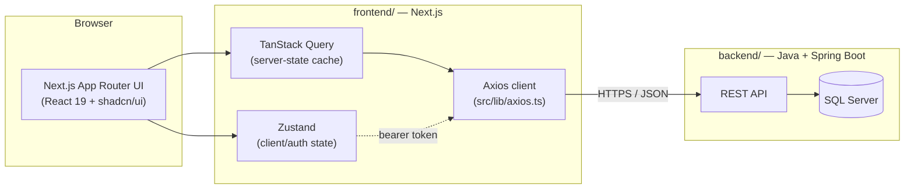
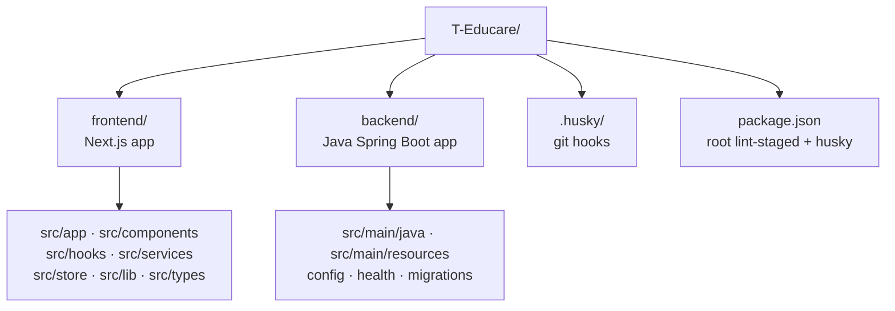

# T-Educare

Education/school management platform, built as a monorepo of two
independently deployable apps:

| App | Path | Status | Stack |
|---|---|---|---|
| Frontend | [`frontend/`](frontend) | Scaffolded | Next.js, TypeScript, Tailwind CSS v4, shadcn/ui, Zustand, Zod, TanStack Query |
| Backend | [`backend/`](backend) | Scaffolded | Java 21, Spring Boot 3.3, Spring Security, MSSQL, Flyway |

See [`CLAUDE.md`](CLAUDE.md) for AI-agent-facing conventions, and
[`frontend/README.md`](frontend/README.md) for frontend-specific docs.

## Architecture



## Repository layout



Each app owns its own `package.json`, lockfile, and `node_modules` — there is
no shared pnpm workspace. The root `package.json` exists only to host the
Husky pre-commit hook and a `lint-staged` config that lints/formats staged
files per-app.

## Getting started

```bash
git clone https://github.com/turontechnologies/T-Educare
cd T-Educare
pnpm install               # installs root husky/lint-staged only
pnpm --dir frontend install
pnpm dev:frontend           # or: cd frontend && pnpm dev
```

For the backend:

```bash
cd backend
cp .env.example .env
docker compose up -d --build
```

Then open the API at `http://localhost:8080/api/health`.

## Contributing

Pre-commit runs `lint-staged` (ESLint + Prettier) on staged files under
`frontend/**`. Don't bypass it with `--no-verify`.
