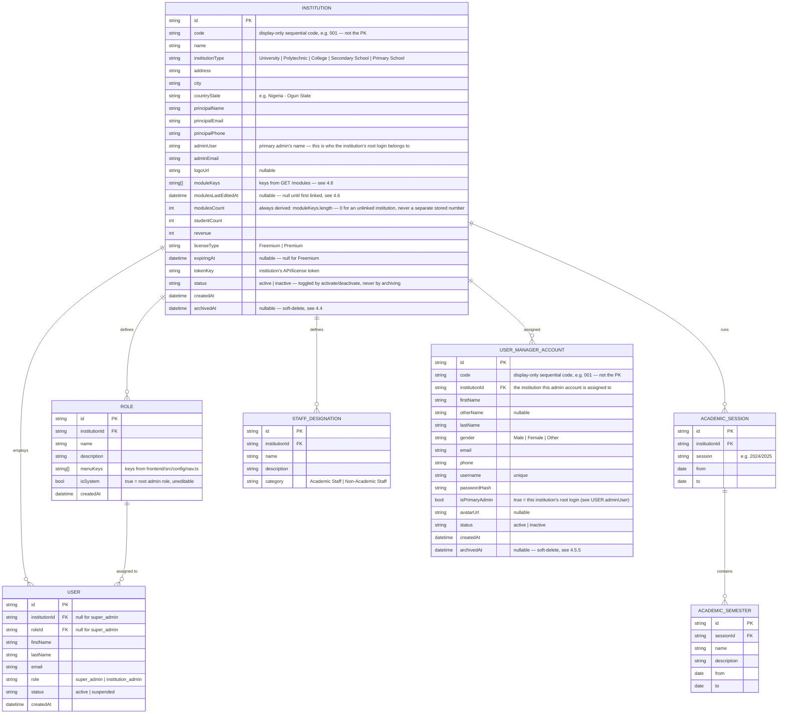
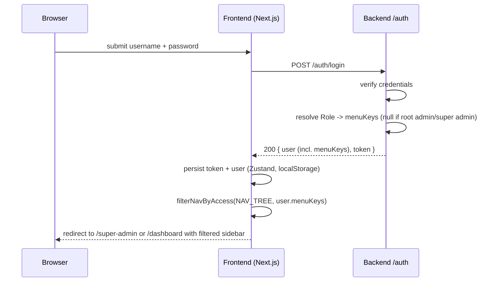
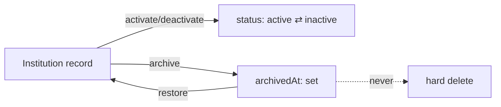
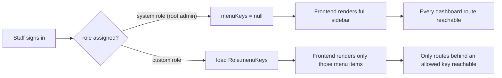
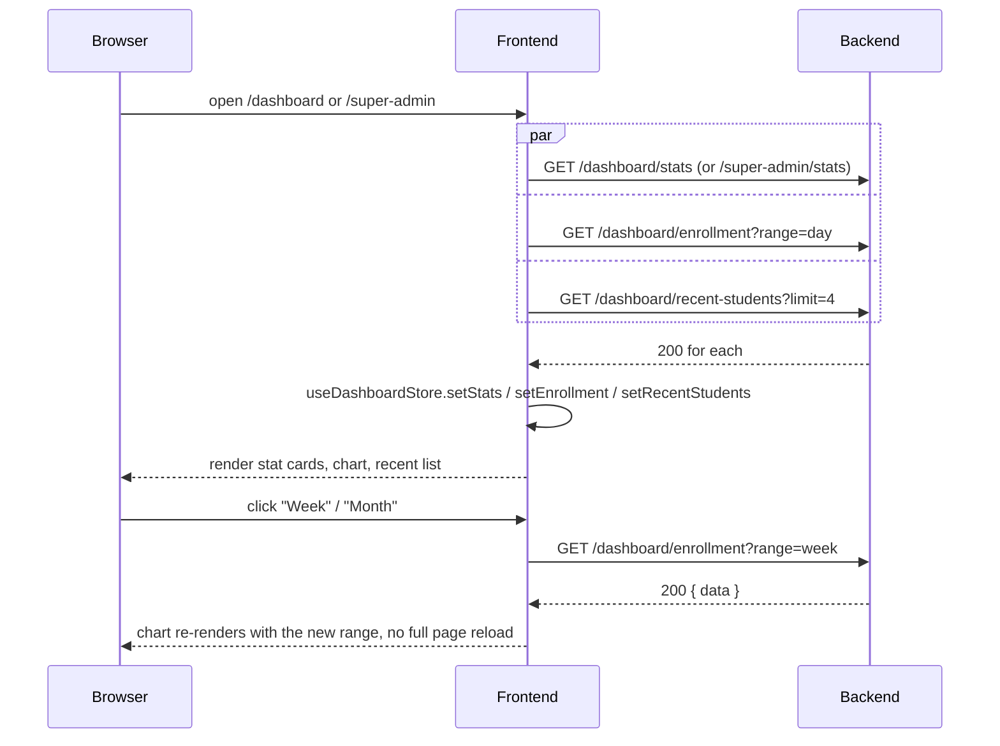

# T-Educare — API Contract

This is the spec the backend must implement so the existing frontend (already
built against a mocked version of this contract — see
[frontend/CLAUDE.md](../frontend/CLAUDE.md#no-backend-yet)) works unchanged
once wired to a real API. It supersedes the short version in
[README.md](./README.md).

Frontend reference points, if anything here is ambiguous:

- `frontend/src/services/auth.service.ts` — current mocked `authService`
- `frontend/src/store/rbac.store.ts` — Role/ManagedUser shape + seed data
- `frontend/src/store/institutions.store.ts` — Institution shape + seed data
- `frontend/src/store/academics.store.ts`, `src/store/staff.store.ts` — the
  two other mocked domains already wired to real pages
- `frontend/src/config/nav.ts` — the full, authoritative list of menu **keys**
  (`INSTITUTION_NAV`, `SUPER_ADMIN_NAV`) referenced by `Role.menuKeys` below

This document only covers what the frontend currently calls. More resources
(Registration, full Academics CRUD, Financials, Results, Hostel, Transport,
Announcements, Requests, Support, etc.) exist today only as nav entries
pointing at placeholder pages — their contracts will follow the same
conventions below and get added here as each one is built.

## Status

**Not implemented yet.** `backend/` has no code — see
[README.md](./README.md) for scaffolding steps. This file is what to build
*against*.

## Deployment

The frontend is deployed and live at **https://t-educare.vercel.app/**
(Vercel), in addition to local dev at `http://localhost:3000`. Both origins
need to work against this API once it exists:

- **CORS**: allow both `http://localhost:3000` and
  `https://t-educare.vercel.app` as origins (`Access-Control-Allow-Origin`),
  with credentials enabled if the auth scheme ends up needing cookies rather
  than the bearer-token approach described below. Don't hardcode just one —
  local dev and the deployed preview both need to reach the API throughout
  development.
- Vercel also generates a preview-deployment URL per branch/PR
  (`https://t-educare-<hash>-<team>.vercel.app` or similar) — if the backend
  needs to support those too, allow-list by suffix/pattern rather than a
  fixed list of exact origins, since each preview gets a new one.
- The frontend currently has no backend to call yet (see Status above), so
  none of this is exercised until `NEXT_PUBLIC_API_URL` is set on both the
  local `.env` and the Vercel project's environment variables to point at
  wherever this API ends up deployed.

---

## 1. Conventions

- **Base URL**: `NEXT_PUBLIC_API_URL` (frontend `.env`), all paths below are
  relative to it.
- **CORS**: allow `http://localhost:3000` (local dev) and
  `https://t-educare.vercel.app` (deployed frontend) — see Deployment above.
- **Auth**: `Authorization: Bearer <token>` on every request except
  `POST /auth/login`. An invalid/expired token → `401`, which the frontend's
  axios interceptor treats as a forced logout.
- **Content type**: `application/json` both ways.
- **IDs**: opaque strings (UUID/cuid — anything stable and non-guessable).
- **Timestamps**: ISO 8601 UTC strings, e.g. `"2026-03-10T14:32:00.000Z"`.
- **Errors**: any non-2xx returns

  ```json
  { "error": "Human-readable message safe to show the user" }
  ```

  (`frontend/src/lib/axios.ts` reads `error.response.data.error` directly
  into the toast shown to the user — keep it short and non-technical.)
- **Lists**: paginated resources return

  ```json
  { "data": [ /* items */ ], "meta": { "page": 1, "perPage": 20, "total": 57 } }
  ```

  Query with `?page=1&perPage=20`. Small, bounded lists (roles, sessions,
  designations — anything an institution manages by hand, not "every
  student") may skip pagination and just return `{ "data": [...] }`.
- **Multi-tenancy is server-enforced, not client-supplied.** Every
  institution-scoped resource (roles, users, sessions, semesters,
  designations, and everything that follows) is implicitly filtered by the
  authenticated user's own institution — derived from their token server-side.
  Never accept a client-supplied `institutionId` on these routes; a request
  from institution A must be structurally incapable of reading or writing
  institution B's data, regardless of what a client sends.
- **Every admin table follows the same Edit / Activate-Deactivate / Delete
  pattern**, deliberately kept identical across resources (institutions,
  user managers, and any future admin list): a single actions menu per row,
  a confirmation prompt before every activate/deactivate/delete, and delete
  always meaning archive (soft-delete, restorable) — never a hard delete.
  This is a frontend/UX convention, not a per-resource quirk, so treat any
  new admin-facing list the same way rather than inventing a new pattern.

---

## 2. Data model



---

## 3. Auth

### `POST /auth/login`

```json
// Request
{ "username": "Turon_Admin", "password": "Turon@2024" }
```

```json
// Response 200
{
  "user": {
    "id": "usr_123",
    "firstName": "Christian",
    "lastName": "Smart",
    "email": "christian.smart@turontech.com",
    "role": "institution_admin",
    "institutionId": "inst_xyz",
    "institutionName": "XYZ College of Technology",
    "menuKeys": null
  },
  "token": "opaque-bearer-token"
}
```

- **An `institution_admin` login authenticates against `UserManagerAccount`
  records (4.5), not a separate identity.** The username/password an
  institution admin logs in with are exactly the credentials shown (and
  editable — see 4.5.3's reset-password) on the super admin's User Manager
  screen. There is no separate "staff directory" of login identities:
  `USER_MANAGER_ACCOUNT.institutionId` decides *which* institution this
  login lands in, and a deactivated (`status: "inactive"`) or archived
  account must be rejected at login even with a correct password. A Role
  (5) is then resolved separately, by whatever mechanism links a Role to a
  person within that institution (today's mock keys this off matching
  email between `UserManagerAccount` and the institution's own staff
  directory — a real implementation should use a proper FK instead, but the
  two-step "which account, then which Role" shape should stay the same).
- `role` is `"super_admin"` or `"institution_admin"`.
- `menuKeys` is the **resolved** permission set for this login, so the
  frontend can render the sidebar without a second round trip:
  - `null` → unrestricted (root admin of the institution, or super admin).
  - `string[]` → exactly the keys from `frontend/src/config/nav.ts` this user
    may see, resolved server-side from their `Role.menuKeys` at login time.
  - **Resolution must apply two layers, not one**: a nav key only belongs in
    the resolved set if (a) the user's Role grants it (or the Role is
    unrestricted) **and** (b) it isn't gated behind a `moduleKey` the
    institution hasn't activated (see 4.6.3) — an unrestricted root admin is
    still capped by their institution's `moduleKeys`, only a restricted Role
    is capped further on top of that. Today's mocked frontend computes this
    same two-layer intersection client-side
    (`filterNavByModules` then `filterNavByAccess` in
    `frontend/src/config/nav.ts`) since it has no login endpoint yet — once
    this exists, move that resolution here and simplify the frontend to just
    render whatever `menuKeys` it's given.
- Wrong credentials → `401 { "error": "Invalid username or password." }`
  (exact copy the frontend already shows for its mocked version — keep it,
  or update `frontend/src/services/auth.service.ts` to match a new one).

### `GET /auth/me`

Returns the same `user` shape as login, for session restore. Requires a
valid bearer token.

### `POST /auth/logout`

Invalidates the token server-side if your auth scheme supports that (e.g.
a session/refresh-token store). `204` on success. The frontend already
clears its own local state regardless of this call's outcome.



---

## 4. Institutions — super admin only

All routes below require `role: "super_admin"` → otherwise `403`.

### 4.1 List / create / edit

| Method | Path                    | Body                                          | Notes |
|--------|-------------------------|------------------------------------------------|-------|
| GET    | `/institutions`         | —                                              | list, supports pagination + `?search=` (matches name or adminUser) + `?includeArchived=true` (default `false` — see 4.4) |
| POST   | `/institutions`         | see 4.2                                        | `modulesCount`/`studentCount`/`revenue` default `0`, `licenseType` defaults `"Freemium"`, `expiringAt` defaults `null`, `status` defaults `"active"` |
| PATCH  | `/institutions/:id`     | any subset of `Institution` fields             | for editing; also accepts `{ status }` alone but prefer 4.3 for that so the intent (and audit trail) is explicit |

`Institution` response shape — see the ER diagram above.

### 4.2 Creating an institution — form fields

The "Add New Institution" form collects everything **except** `modulesCount`
and `licenseType` — those are configured afterwards via the Modules and
License Manager screens (still placeholders on the frontend today), so a
freshly created institution always starts at `modulesCount: 0`,
`licenseType: "Freemium"`, `expiringAt: null`.

```json
// POST /institutions request body
{
  "name": "Covenant University",
  "institutionType": "University",
  "address": "KM 10 Idiroko Road",
  "city": "Ota",
  "countryState": "Nigeria - Ogun State",
  "principalName": "Prof. David Oyedepo",
  "principalEmail": "principal@covenantuniversity.edu.ng",
  "principalPhone": "08011112222",
  "adminUser": "Ngozi Eze",
  "adminEmail": "admin@covenantuniversity.edu.ng",
  "logoUrl": "https://cdn.example.com/logos/covenant.png"
}
```

`logoUrl` — the frontend currently only previews the picked file locally
(via `URL.createObjectURL`, never uploaded anywhere). A real backend should
expose a small upload endpoint (e.g. `POST /uploads/institution-logo`,
multipart, returning `{ "url": "..." }`) that the frontend calls first, then
sends the resulting `url` as `logoUrl` in this request.

`code` and `tokenKey` are server-generated — never accept them from the
client. `id` and `createdAt` are standard server-generated fields.

### 4.3 Activate / deactivate

```
PATCH /institutions/:id/status
{ "status": "active" }   // or "inactive"
```

The frontend always confirms this with the user first ("Are you sure you
want to activate/deactivate X?") before calling it — that's a client-side
UX guard, not something the backend needs to enforce, but do treat this as
a meaningful state transition worth its own audit log entry (an institution
losing access is a significant event for whoever their `adminUser` is).

### 4.4 Archive / restore — soft delete only

**There is no hard-delete endpoint for institutions.** The frontend's
"delete" action archives instead — it sets `archivedAt` and hides the record
from the default list view; nothing is ever destroyed.

```
POST /institutions/:id/archive   → 200, sets archivedAt = now
POST /institutions/:id/restore   → 200, sets archivedAt = null
```

`GET /institutions` excludes archived records unless `?includeArchived=true`
is passed (that's what the frontend's "View archived" toggle calls). An
archived institution keeps its `status` field as-is (archiving is
orthogonal to active/inactive) — restoring one doesn't change `status`
either, it comes back exactly as it was archived.



### 4.5 User Manager — super admin only

Platform-level admin accounts, each assigned to one institution (the "User
Manager" screen at `/super-admin/user-manager`). This is distinct from
section 6 (`USER`/roles) — that's institution-scoped staff managed by an
*institution admin*; this is the super admin provisioning the institution's
own admin accounts.

#### 4.5.1 List / create / edit

| Method | Path                     | Body                                          | Notes |
|--------|--------------------------|------------------------------------------------|-------|
| GET    | `/user-managers`         | —                                              | list, supports pagination + `?search=` (matches username, email, or institution name) + `?includeArchived=true` (default `false` — see 4.5.5) |
| POST   | `/user-managers`         | see 4.5.2                                      | `status` defaults `"active"` |
| PATCH  | `/user-managers/:id`     | any subset of `UserManagerAccount` fields       | for editing |

`UserManagerAccount` response shape — see the ER diagram above. Never
returns `passwordHash`.

#### 4.5.2 Creating an account — form fields

```json
// POST /user-managers request body
{
  "firstName": "Chris",
  "otherName": "Oluwakemi",
  "lastName": "Smart",
  "gender": "Male",
  "email": "chrissmart10@gmail.com",
  "phone": "08023778912",
  "username": "chrissmart10",
  "password": "a-plaintext-password-hashed-server-side",
  "institutionId": "inst-babcock",
  "isPrimaryAdmin": true,
  "avatarUrl": "https://cdn.example.com/avatars/chris.png"
}
```

The frontend's "Generate username" / "Generate password" buttons are purely
client-side conveniences (random suggestions the admin can edit before
submitting) — the server should still validate `username` uniqueness and
apply its own password policy, never trust the generated value's strength.

`avatarUrl` — same convention as institution `logoUrl` (4.2): frontend only
previews the picked file locally today; wire it to a real upload endpoint
when one exists.

`code` is server-generated — never accept it from the client. `id` and
`createdAt` are standard server-generated fields.

#### 4.5.3 Activate / deactivate

```
PATCH /user-managers/:id/status
{ "status": "active" }   // or "inactive"
```

Same convention as institutions (4.3): the frontend always confirms this
with the user first ("Are you sure you want to activate/deactivate X?"),
and it's worth its own audit log entry — a deactivated account should be
rejected at login even if its `passwordHash` still matches.

Both this and the institutions table drive their Edit / Activate-Deactivate
/ Delete actions from the same dropdown-menu pattern in the frontend (see
`src/components/ui/dropdown-menu.tsx`) — kept deliberately identical across
every admin table for consistency, not just this one.

#### 4.5.4 Reset password

```
POST /user-managers/:id/reset-password   → 200, { "password": "<new-plaintext-password>" }
```

The frontend always confirms this with the user first ("Are you sure you
want to reset the password for X?") before calling it. The server generates
a new password, hashes and stores it, and returns the plaintext exactly
once in the response so the admin can hand it to the account owner — it is
never retrievable again after that.

#### 4.5.5 Archive / restore — soft delete only

**There is no hard-delete endpoint for user manager accounts** — same
convention as institutions (4.4). The frontend's "delete" action archives
instead.

```
POST /user-managers/:id/archive   → 200, sets archivedAt = now
POST /user-managers/:id/restore   → 200, sets archivedAt = null
```

`GET /user-managers` excludes archived records unless
`?includeArchived=true` is passed. Archiving is orthogonal to `status`
(active/inactive) — restoring an account doesn't change `status`.

### 4.6 Modules — linking institutions to platform features

The "Modules" screen (`/super-admin/modules`) lets a super admin activate a
fixed catalog of platform features per institution. This extends the
`Institution` resource (4.1) rather than introducing a new one — see the two
new fields on `INSTITUTION` in the ER diagram above:

- `moduleKeys: string[]` — keys from the catalog below that are activated
  for this institution. Empty (`[]`) until the institution is first linked.
- `modulesLastEditedAt: datetime | null` — set whenever `moduleKeys` is
  saved; `null` if never linked.

#### 4.6.1 Module catalog

```
GET /modules   → 200, { "data": [ { "key": "payment", "label": "Payment module" }, ... ] }
```

A small, fixed, server-owned list (not institution-specific) — the frontend
currently hardcodes it at `frontend/src/config/modules.ts` (19 entries:
Payment module, Students, Lecturer, Exams, Results, Reports, SMS
Integration, USSD Services, Hotels, Accommodations, Registration, Faculty,
Department, School, Courses, Transport, Referral Application, Resit
Module, Admission). Expose it as a real endpoint so the catalog can grow
without a frontend redeploy; keep the same `key`s if so, since they're
referenced by every institution's `moduleKeys`.

#### 4.6.2 List / link / edit

The Modules table only lists institutions with at least one activated
module — i.e. `GET /institutions` filtered client-side (today) by
`moduleKeys.length > 0`; no separate list endpoint is needed for the table
itself.

```
PATCH /institutions/:id/modules
{ "moduleKeys": ["payment", "students", "exams"] }
→ 200, sets moduleKeys, modulesCount = moduleKeys.length,
  modulesLastEditedAt = now, and status = "active"
```

That last side effect — activating an institution's status as part of
saving its modules — matches the frontend copy shown after picking an
institution in the "Link New Institution" dialog ("X is been selected and
made active"). The dialog only calls this endpoint once on Save; selecting
an institution and toggling checkboxes beforehand is local-only, so
cancelling the dialog persists nothing.

**The "Select an Institution" dropdown inside that dialog is a different
query from the table above — and it matters which one the backend serves:**

```
GET /institutions?unlinkedOnly=true
```

This must return **only** institutions with `moduleKeys.length === 0` (i.e.
never linked yet) — the same institutions that exist on the Institutions
page (4.1), just filtered to the ones nobody has assigned modules to. It
must never return an institution that already has `moduleKeys` set; editing
an already-linked institution's modules happens by clicking its name in the
Modules table instead (which opens the same dialog pre-filled via
`GET /institutions/:id`, not this endpoint). Getting this filter wrong
either lets a super admin silently overwrite an existing institution's
module set through the wrong entry point, or makes an unlinked institution
impossible to find once the list grows past a page or two.

#### 4.6.3 Effect on the institution's own dashboard

An institution's `moduleKeys` don't just drive this super-admin table —
they cap what that institution's *own* staff can ever be granted access to.
`frontend/src/config/nav.ts` maps a subset of `INSTITUTION_NAV` items to a
`moduleKey` (e.g. the `students` nav item requires the `students` module;
see the file for the full mapping — several nav items, like Dashboard,
Academic Sessions, and User Management, are intentionally ungated and
always available). Two places consume this:

- The institution dashboard's sidebar (`src/app/dashboard/layout.tsx`) —
  even the institution's unrestricted root admin only sees nav items backed
  by an activated module; "full access" means full access to what's been
  switched on for that institution, not the entire platform nav.
- The Role editor's menu-access picker
  (`src/components/features/user-management/role-dialog.tsx`) — an
  institution admin can only grant a custom Role access to menu items their
  own institution has been given, so a Role can never be built with reach
  beyond what the super admin allowed.

No new endpoint is needed for this — the frontend already has the calling
user's `institutionId` (from `POST /auth/login`, see 3) and that
institution's `moduleKeys` (from `GET /institutions/:id`, implicitly scoped
server-side to the caller's own institution per the multi-tenancy rule in
§1). Just make sure `moduleKeys` is included in whatever the institution
admin's own session/profile calls return — it's load-bearing for their nav,
not only for the super admin's Modules screen.

---

## 5. Roles — institution admin, scoped to their own institution

All routes require `role: "institution_admin"`; results are implicitly
scoped to the caller's `institutionId`.

| Method | Path          | Body                                                    | Notes |
|--------|---------------|----------------------------------------------------------|-------|
| GET    | `/roles`      | —                                                        | includes the seeded system role |
| POST   | `/roles`      | `{ name, description, menuKeys: string[] }`               | `isSystem` always `false` for created roles |
| PATCH  | `/roles/:id`  | `{ name?, description?, menuKeys? }`                       | `403` if the target role `isSystem: true` |
| DELETE | `/roles/:id`  | —                                                        | `403` if `isSystem: true`; `409` if any user is still assigned it |

`menuKeys` must be validated server-side against the known key set (mirror
`frontend/src/config/nav.ts`'s `INSTITUTION_NAV` keys) — reject unknown keys
rather than silently storing them.

## 6. Users (staff) — institution admin, scoped to their own institution

| Method | Path          | Body                                        | Notes |
|--------|---------------|-----------------------------------------------|-------|
| GET    | `/users`      | —                                            | staff within the caller's institution |
| POST   | `/users`      | `{ name, email, roleId }`                     | `status` defaults `"active"`; this is what provisions a real login for that staff member (send them a credential/invite — mechanism is up to the backend) |
| PATCH  | `/users/:id`  | `{ name?, email?, roleId?, status? }`          | |
| DELETE | `/users/:id`  | —                                            | |



---

## 7. Academic Sessions & Semesters — institution admin

| Method | Path                        | Body                                                        |
|--------|-----------------------------|---------------------------------------------------------------|
| GET    | `/academic-sessions`        | —                                                              |
| POST   | `/academic-sessions`        | `{ session, from, to }`                                        |
| DELETE | `/academic-sessions/:id`    | —                                                              |
| GET    | `/academic-semesters`       | —                                                              |
| POST   | `/academic-semesters`       | `{ sessionId, name, description, from, to }`                    |
| DELETE | `/academic-semesters/:id`   | —                                                              |

`from`/`to` are plain `dd-mm-yyyy` strings in the current frontend mock —
either keep that (simplest, matches existing UI verbatim) or switch to ISO
dates and update `frontend/src/store/academics.store.ts` + the two forms in
`frontend/src/app/dashboard/academics/sessions/page.tsx` together.

## 8. Staff Designations — institution admin

| Method | Path                        | Body                                             |
|--------|-----------------------------|-----------------------------------------------------|
| GET    | `/staff-designations`       | —                                                    |
| POST   | `/staff-designations`       | `{ name, description, category }`                     |
| PATCH  | `/staff-designations/:id`   | `{ name?, description?, category? }`                   |
| DELETE | `/staff-designations/:id`   | —                                                    |

`category` is `"Academic Staff" | "Non-Academic Staff"`.

---

## 9. Dashboards

Both dashboards (`frontend/src/app/dashboard/page.tsx` and
`frontend/src/app/super-admin/page.tsx`) read from
`frontend/src/store/dashboard.store.ts` and `institutions.store.ts` today —
these routes are what should replace those stores' seed data.

### 9.1 Institution admin — `GET /dashboard/stats`

Scoped to the caller's own institution.

```json
{
  "registeredStudents": 48043,
  "applicants": 158429,
  "lecturers": 10238,
  "accumulatedProfit": 1248043
}
```

### 9.2 Institution admin — `GET /dashboard/enrollment?range=day|week|month`

Powers the "Registered students per program" chart. `range` defaults to
`"day"`.

```json
{ "data": [ { "label": "6am", "value": 8 }, { "label": "9am", "value": 22 } ] }
```

`label` is whatever the frontend should print on the x-axis for that
`range` (hour-of-day for `day`, weekday for `week`, month for `month`) —
the backend owns the bucketing, the frontend just renders what it's given.

### 9.3 Institution admin — `GET /dashboard/recent-students?limit=4`

```json
{
  "data": [
    { "id": "std_1", "name": "Amaka Chukwu", "registeredAt": "2026-09-10T07:12:00.000Z" }
  ]
}
```

`registeredAt` is a real ISO timestamp — the frontend formats it as relative
time ("2 hours ago") itself, don't pre-format it server-side.

### 9.4 Super admin — `GET /super-admin/stats`

A precomputed summary so the client doesn't have to page through every
institution just to sum three numbers (it can still cross-check against
`GET /institutions` — see §4 — but shouldn't have to).

```json
{ "institutionsCount": 27, "totalStudents": 5622, "totalRevenue": 1528600 }
```

(The frontend's mock seed currently has 27 institutions, for a realistic
pagination/search demo — see `institutions.store.ts`. Numbers above match
that seed; a real backend obviously computes them from actual rows and
should exclude archived institutions from the count, same as §4.4.)

The "Recent Added Institutions" table on this same dashboard is just
`GET /institutions` (§4) sorted by `createdAt` desc, `limit=5` — no separate
endpoint needed.



---

## 10. What's mocked today, for reference

Until the above exists, the frontend fakes all of it client-side with three
hardcoded demo accounts (see `frontend/src/services/auth.service.ts`) and
Zustand stores seeded with fixture data (`persist`-backed for anything a user
edits — roles, users, institutions, user managers, sessions, designations;
plain, unpersisted for read-only dashboard data — see `dashboard.store.ts`)
— swap each store's actions for real calls to the routes above one domain
at a time; nothing else in the UI needs to change.
