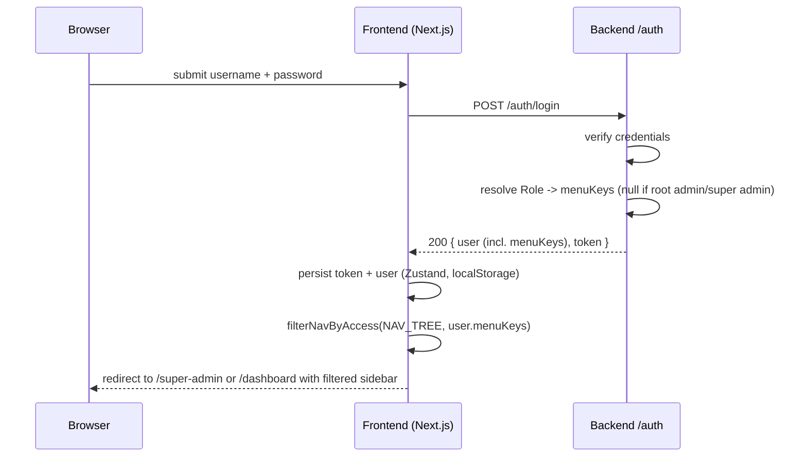
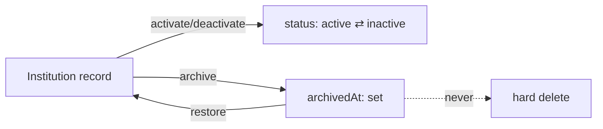
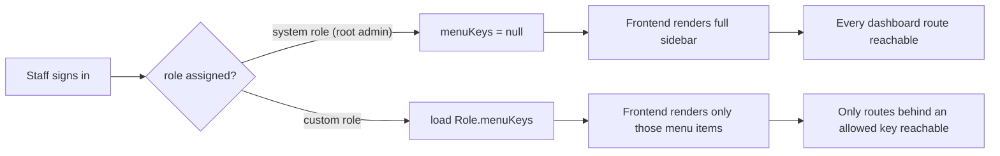
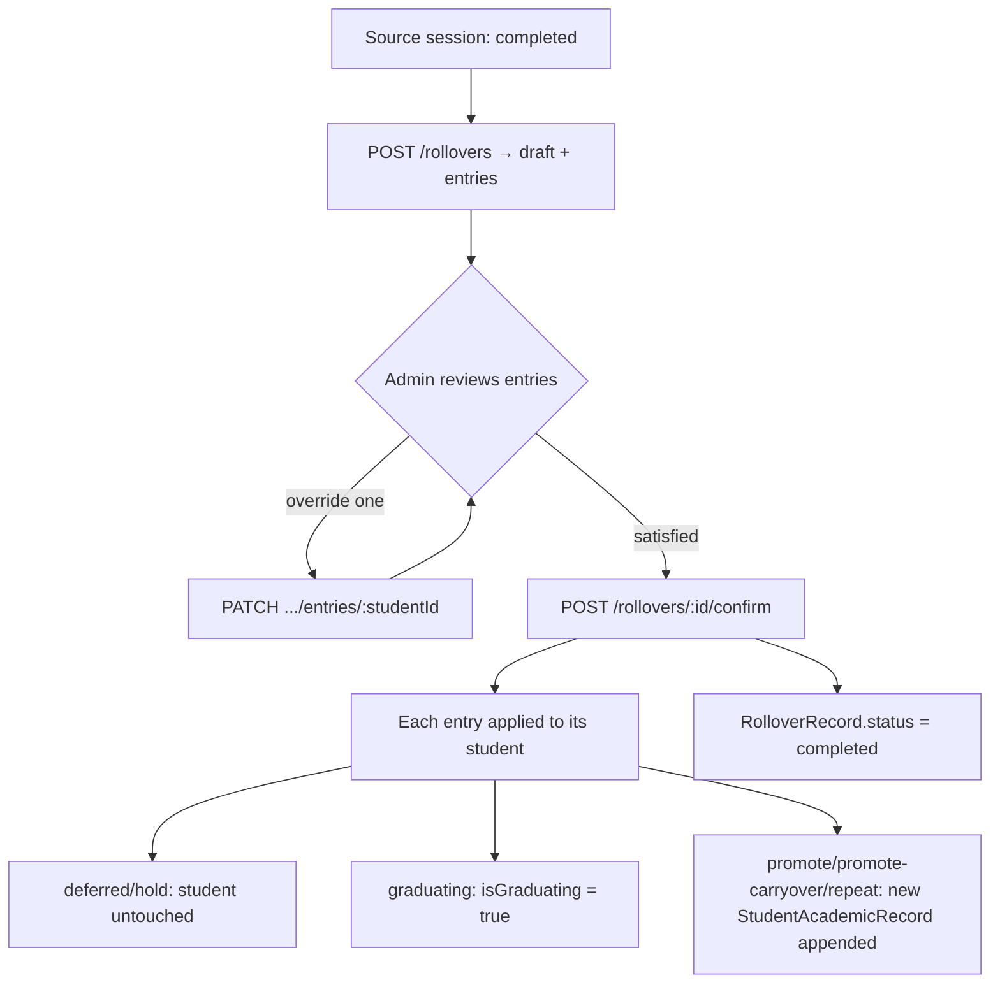
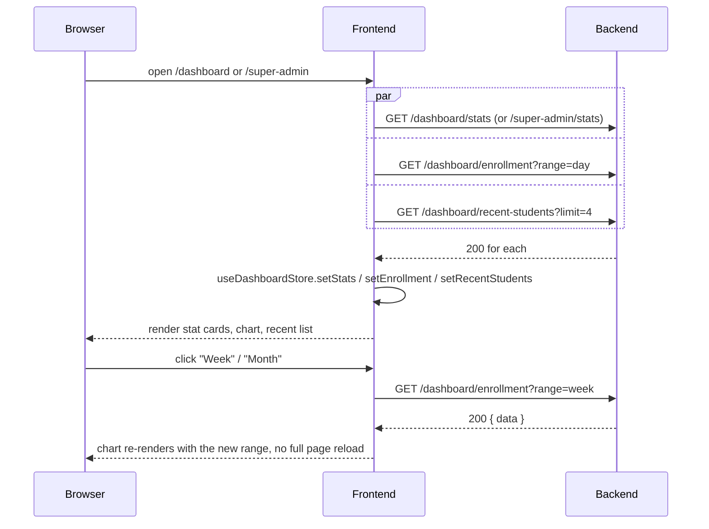
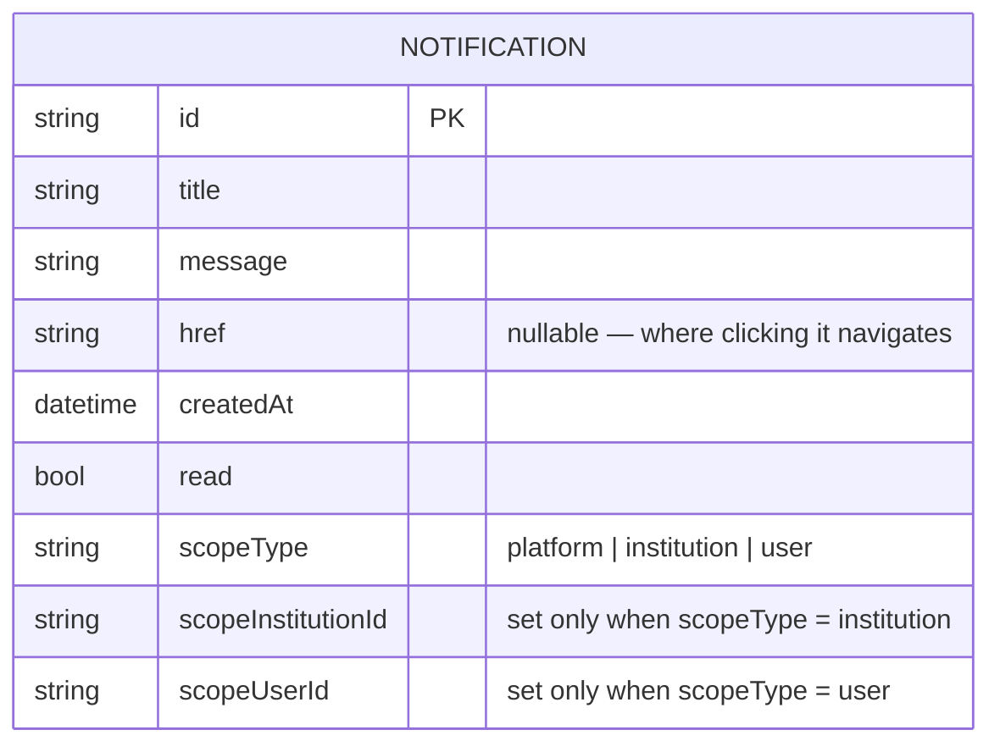

# T-Educare — API Contract

This is the spec the backend must implement so the existing frontend (already
built against a mocked version of this contract — see
[frontend/CLAUDE.md](../frontend/CLAUDE.md#no-backend-yet)) works unchanged
once wired to a real API. It supersedes the short version in
[README.md](./README.md).

Frontend reference points, if anything here is ambiguous:

- `frontend/src/services/auth.service.ts` — current mocked `authService`
- `frontend/src/store/rbac.store.ts` — Role/ManagedUser shape + seed data
- `frontend/src/store/institutions.store.ts` — Institution shape + seed data
- `frontend/src/store/academics.store.ts`, `src/store/staff.store.ts` — the
  two other mocked domains already wired to real pages
- `frontend/src/config/nav.ts` — the full, authoritative list of menu **keys**
  (`INSTITUTION_NAV`, `SUPER_ADMIN_NAV`) referenced by `Role.menuKeys` below

This document only covers what the frontend currently calls. More resources
(Registration, full Academics CRUD, Financials, Results, Hostel, Transport,
Announcements, Requests, Support, etc.) exist today only as nav entries
pointing at placeholder pages — their contracts will follow the same
conventions below and get added here as each one is built.

## Status

**Auth (§3), Profile (§3.1), file uploads (§3.2), Dashboards (§9), and
Institutions §4.1/4.3/4.4 (§4) are implemented and live** — see
`backend/README.md`'s "What's implemented" section for exactly what that
covers (real MSSQL-backed tables via Flyway, not in-memory; real Cloudinary
uploads, not local-only previews). Institutions and uploads are
backend-only for now — not yet wired to the frontend (see each section's
own note). Everything else below (§4.5-4.7, Roles, Users, Academic Sessions,
Students, Schools/Faculties/Departments/Programs, Staff, Notifications) is
**not implemented yet** — this file remains what to build those *against*.

## Deployment

The frontend is deployed and live at **https://t-educare.vercel.app/**
(Vercel), in addition to local dev at `http://localhost:3000`. Both origins
need to work against this API once it exists:

- **CORS**: allow both `http://localhost:3000` and
  `https://t-educare.vercel.app` as origins (`Access-Control-Allow-Origin`),
  with credentials enabled if the auth scheme ends up needing cookies rather
  than the bearer-token approach described below. Don't hardcode just one —
  local dev and the deployed preview both need to reach the API throughout
  development.
- Vercel also generates a preview-deployment URL per branch/PR
  (`https://t-educare-<hash>-<team>.vercel.app` or similar) — if the backend
  needs to support those too, allow-list by suffix/pattern rather than a
  fixed list of exact origins, since each preview gets a new one.
- The frontend currently has no backend to call yet (see Status above), so
  none of this is exercised until `NEXT_PUBLIC_API_URL` is set on both the
  local `.env` and the Vercel project's environment variables to point at
  wherever this API ends up deployed.

---

## 1. Conventions

- **Base URL**: `NEXT_PUBLIC_API_URL` (frontend `.env`), all paths below are
  relative to it.
- **CORS**: allow `http://localhost:3000` (local dev) and
  `https://t-educare.vercel.app` (deployed frontend) — see Deployment above.
- **Auth**: `Authorization: Bearer <token>` on every request except
  `POST /auth/login`. An invalid/expired token → `401`, which the frontend's
  axios interceptor treats as a forced logout.
- **Content type**: `application/json` both ways.
- **IDs**: opaque strings (UUID/cuid — anything stable and non-guessable).
- **Timestamps**: ISO 8601 UTC strings, e.g. `"2026-03-10T14:32:00.000Z"`.
- **Errors**: any non-2xx returns

  ```json
  { "error": "Human-readable message safe to show the user" }
  ```

  (`frontend/src/lib/axios.ts` reads `error.response.data.error` directly
  into the toast shown to the user — keep it short and non-technical.)
- **Lists**: paginated resources return

  ```json
  { "data": [ /* items */ ], "meta": { "page": 1, "perPage": 20, "total": 57 } }
  ```

  Query with `?page=1&perPage=20`. Small, bounded lists (roles, sessions,
  designations — anything an institution manages by hand, not "every
  student") may skip pagination and just return `{ "data": [...] }`.
- **Multi-tenancy is server-enforced, not client-supplied.** Every
  institution-scoped resource (roles, users, sessions, semesters,
  designations, and everything that follows) is implicitly filtered by the
  authenticated user's own institution — derived from their token server-side.
  Never accept a client-supplied `institutionId` on these routes; a request
  from institution A must be structurally incapable of reading or writing
  institution B's data, regardless of what a client sends.
- **Every admin table follows the same Edit / [resource-specific action] /
  Delete pattern**, deliberately kept identical across resources —
  institutions (Edit / Activate-Deactivate / Delete), user managers (Edit /
  Reset password / Delete), license records (Edit / Regenerate key /
  Revoke), and any future admin list: a single actions menu per row, a
  confirmation prompt before every state-changing action, and "delete"
  meaning either archive (institutions, user managers — soft-delete,
  restorable, never a hard delete) or a reset-to-default (license records —
  see 4.7.2, since nothing is actually being deleted there). This is a
  frontend/UX convention, not a per-resource quirk, so treat any new
  admin-facing list the same way rather than inventing a new pattern.
- **Every select/dropdown in the frontend renders through one of two shared
  components** (`frontend/src/components/shared/notched-field.tsx`) rather
  than a bare `<select>`: `NotchedSelectField` for short, fixed option
  lists (gender, license type), `NotchedComboboxField` — a searchable
  combobox — for anything with "a lot of information" to scroll through
  (institutions, states/countries). A date field goes through
  `NotchedDateField` (a real calendar popup, not a native
  `<input type="date">`). This doesn't change anything about this API
  contract, but if you're the one eventually building the admin UI against
  it, don't reintroduce native form controls for these — reuse the shared
  components so every dropdown/date-picker in the app stays visually and
  behaviorally consistent.

---

## 2. Data model

```mermaid
erDiagram
    INSTITUTION ||--o{ ROLE : "defines"
    INSTITUTION ||--o{ USER : "employs"
    INSTITUTION ||--o{ ACADEMIC_SESSION : "runs"
    INSTITUTION ||--o{ STAFF_DESIGNATION : "defines"
    INSTITUTION ||--o{ STAFF_MEMBER : "employs"
    DEPARTMENT ||--o{ STAFF_MEMBER : "assigned to"
    INSTITUTION ||--o{ LECTURER : "employs"
    SCHOOL ||--o{ LECTURER : "assigned to when assignmentType=school, see 8.2"
    FACULTY ||--o{ LECTURER : "assigned to when assignmentType=faculty, see 8.2"
    INSTITUTION ||--o{ USER_MANAGER_ACCOUNT : "assigned"
    ACADEMIC_SESSION ||--o{ ACADEMIC_SEMESTER : "contains"
    ROLE ||--o{ USER : "assigned to"
    INSTITUTION ||--o{ STUDENT : "enrolls"
    ACADEMIC_SESSION ||--o{ STUDENT : "currently enrolled under"
    INSTITUTION ||--o{ SCHOOL : "defines"
    SCHOOL ||--o{ STUDENT : "enrolled under"
    SCHOOL ||--o{ FACULTY : "contains"
    FACULTY ||--o{ DEPARTMENT : "contains"
    SCHOOL ||--o{ DEPARTMENT : "independently linked to, see 7.6"
    DEPARTMENT ||--o{ PROGRAM : "offers"
    FACULTY ||--o{ PROGRAM : "independently linked to, see 7.7"
    INSTITUTION ||--o{ PROGRAM_LEVEL : "defines"
    INSTITUTION ||--o{ COURSE_GRADE : "defines"
    INSTITUTION ||--|| GRADING_SCALE : "configures"
    DEPARTMENT ||--o{ COURSE : "offers"
    SCHOOL ||--o{ COURSE : "independently linked to, see 7.10"
    INSTITUTION ||--o{ ROLLOVER_RECORD : "runs"
    ACADEMIC_SESSION ||--o{ ROLLOVER_RECORD : "rolled over from/to"

    INSTITUTION {
        string id PK
        string code "display-only sequential code, e.g. 001 — not the PK"
        string name
        string institutionType "University | Polytechnic | College | Secondary School | Primary School"
        string address
        string city
        string countryState "e.g. Nigeria - Ogun State"
        string principalName
        string principalEmail
        string principalPhone
        string adminUser "primary admin's name — this is who the institution's root login belongs to"
        string adminEmail
        string logoUrl "nullable"
        string[] moduleKeys "keys from GET /modules — see 4.6"
        datetime modulesLastEditedAt "nullable — null until first linked, see 4.6"
        int modulesCount "always derived: moduleKeys.length — 0 for an unlinked institution, never a separate stored number"
        int studentCount
        int revenue
        string licenseType "Basic | Standard | Premium"
        datetime expiringAt "nullable — null only for Basic (the free tier); Standard/Premium always have one, see 4.7"
        string tokenKey "institution's general API/access token — distinct from licenseKey, see 4.7"
        string licenseKey "nullable — this institution's license record's own key, set via /super-admin/license-manager, see 4.7"
        datetime licenseIssuedAt "nullable — immutable once set, the license record's original creation date, see 4.7"
        string status "active | inactive — toggled by activate/deactivate, never by archiving"
        datetime createdAt
        datetime archivedAt "nullable — soft-delete, see 4.4"
    }
    ROLE {
        string id PK
        string institutionId FK
        string name
        string description
        string[] menuKeys "keys from frontend/src/config/nav.ts"
        bool isSystem "true = root admin role, uneditable"
        datetime createdAt
    }
    USER {
        string id PK
        string institutionId FK "null for super_admin"
        string roleId FK "null for super_admin"
        string firstName
        string lastName
        string email
        string role "super_admin | institution_admin"
        string status "active | suspended"
        datetime createdAt
    }
    ACADEMIC_SESSION {
        string id PK
        string institutionId FK
        string session "e.g. 2024/2025"
        date from
        date to
        string status "upcoming | active | completed"
        bool isCurrent "at most one session per institution — see 7.1"
        datetime archivedAt "nullable — soft-delete"
    }
    ACADEMIC_SEMESTER {
        string id PK
        string sessionId FK
        string name
        string description
        date from
        date to
        string status "upcoming | active | completed"
        bool isCurrent "at most one semester per session — see 7.1"
        datetime archivedAt "nullable — soft-delete"
    }
    STUDENT {
        string id PK
        string institutionId FK
        string matricNo "display code, e.g. UL-10044 — unique among non-archived students"
        string title "Mr | Mrs | Miss | Dr | Chief | Engr | Prof"
        string firstName
        string middleName "nullable"
        string lastName
        string otherName "nullable — a distinct alternate/preferred name, not the same as middleName"
        string gender "Male | Female | Other"
        string maritalStatus "Single | Married | Divorced | Widowed"
        string email
        string phone
        string emergencyContact
        datetime dateOfBirth
        string religion "Christian | Islam | Traditional | Other"
        string maidenName "nullable"
        string bloodGroup "A+ | A- | B+ | B- | AB+ | AB- | O+ | O-"
        string genotype "AA | AS | SS | AC"
        int weightKg
        int heightCm
        string nationality
        string stateOfOrigin
        string lga
        string residentAddress
        string avatarUrl "nullable"
        string schoolId FK "SCHOOL.id"
        string faculty
        string department
        string programme
        string currentLevel "e.g. 100 Level"
        string currentSessionId FK "ACADEMIC_SESSION.id — the session this student is currently enrolled under"
        string status "active | inactive — admin-facing enrollment status, distinct from the flags below"
        bool isGraduating
        bool isDeferred
        bool holdForReview
        datetime createdAt
        datetime archivedAt "nullable — soft-delete"
    }
    SCHOOL {
        string id PK
        string institutionId FK
        string name "e.g. School of Engineering"
        string headName
        string designation "validated against STAFF_DESIGNATION.name — see 7.4/8"
        datetime createdAt
        datetime archivedAt "nullable — soft-delete"
    }
    FACULTY {
        string id PK
        string institutionId FK
        string schoolId FK "SCHOOL.id"
        string name "e.g. Faculty of Law"
        string deanName
        datetime createdAt
        datetime archivedAt "nullable — soft-delete"
    }
    DEPARTMENT {
        string id PK
        string institutionId FK
        string facultyId FK "FACULTY.id"
        string schoolId FK "SCHOOL.id — independent of facultyId, see 7.6"
        string name "e.g. Mathematics Department"
        string hodName
        datetime createdAt
        datetime archivedAt "nullable — soft-delete"
    }
    PROGRAM {
        string id PK
        string institutionId FK
        string departmentId FK "DEPARTMENT.id"
        string facultyId FK "FACULTY.id — independent of departmentId, see 7.7"
        string name "e.g. Computing and IT"
        string programType "Undergraduate | Postgraduate"
        datetime createdAt
        datetime archivedAt "nullable — soft-delete"
    }
    PROGRAM_LEVEL {
        string id PK
        string institutionId FK
        string levelCode "e.g. 100 — independent lookup, not related to STUDENT.currentLevel, see 7.8"
        string description "e.g. 100 levels"
        datetime createdAt
        datetime archivedAt "nullable — soft-delete"
    }
    COURSE_GRADE {
        string id PK
        string institutionId FK
        string code "e.g. A, AB"
        string remark "e.g. Distinction"
        float gradeScore
        float minimumScore
        float maximumScore
        datetime createdAt
        datetime archivedAt "nullable — soft-delete"
    }
    GRADING_SCALE {
        string institutionId PK "one row per institution, not a normal CRUD resource — see 7.9"
        float maxGradePoint
    }
    COURSE {
        string id PK
        string institutionId FK
        string departmentId FK "DEPARTMENT.id"
        string schoolId FK "SCHOOL.id — independent of departmentId, see 7.10"
        string name "e.g. Pure Mathematics"
        string code "e.g. MAT101 — unique among non-archived courses"
        datetime createdAt
        datetime archivedAt "nullable — soft-delete"
    }
    ROLLOVER_RECORD {
        string id PK
        string institutionId FK
        string fromSessionId FK
        string toSessionId FK
        datetime createdAt
        datetime completedAt "nullable — null while status is draft"
        string status "draft | completed"
    }
    STAFF_DESIGNATION {
        string id PK
        string institutionId FK
        string name
        string description
        string category "Academic Staff | Non-Academic Staff"
        datetime createdAt
        datetime archivedAt "nullable — soft-delete"
    }
    STAFF_MEMBER {
        string id PK
        string institutionId FK
        string staffId "display code, e.g. UL-10010 — unique among non-archived staff"
        string role "validated against STAFF_DESIGNATION.name, see 8.1"
        string designation "validated against STAFF_DESIGNATION.name — a separate field from role, see 8.1"
        string departmentId FK "DEPARTMENT.id"
        string gender "Male | Female | Other"
        string firstName
        string middleName "nullable"
        string lastName
        string otherName "nullable"
        string maritalStatus "Single | Married | Divorced | Widowed"
        string email
        string phone
        string emergencyContact
        datetime dateOfBirth
        datetime employmentStartDate
        string contactAddress
        string avatarUrl "nullable"
        datetime createdAt
        datetime archivedAt "nullable — soft-delete"
    }
    LECTURER {
        string id PK
        string institutionId FK
        string username "display code, e.g. UL-10010 — unique among non-archived lecturers"
        string position "Dean of a Faculty | Head of Department | Provost | Professor | Associate Professor | Senior Lecturer | Lecturer I | Lecturer II | Assistant Lecturer — see 8.2"
        string assignmentType "school | faculty"
        string assignmentId "polymorphic FK — SCHOOL.id when assignmentType=school, FACULTY.id when assignmentType=faculty, see 8.2"
        string gender "Male | Female | Other"
        string firstName
        string middleName "nullable"
        string lastName
        string otherName "nullable"
        string email
        string phone
        datetime createdAt
        datetime archivedAt "nullable — soft-delete"
    }
    USER_MANAGER_ACCOUNT {
        string id PK
        string code "display-only sequential code, e.g. 001 — not the PK"
        string institutionId FK "the institution this admin account is assigned to"
        string firstName
        string otherName "nullable"
        string lastName
        string gender "Male | Female | Other"
        string email
        string phone
        string username "unique"
        string passwordHash
        bool isPrimaryAdmin "true = this institution's root login (see USER.adminUser)"
        string avatarUrl "nullable"
        string status "active | inactive"
        datetime createdAt
        datetime archivedAt "nullable — soft-delete, see 4.5.5"
    }
```



---

## 3. Auth

### `POST /auth/login`

```json
// Request
{ "username": "Turon_Admin", "password": "Turon@2024" }
```

```json
// Response 200
{
  "user": {
    "id": "usr_123",
    "firstName": "Christian",
    "lastName": "Smart",
    "email": "christian.smart@turontech.com",
    "role": "institution_admin",
    "institutionId": "inst_xyz",
    "institutionName": "XYZ College of Technology",
    "roleId": "role_abc",
    "menuKeys": null,
    "phone": "08022223333",
    "avatarUrl": ""
  },
  "token": "opaque-bearer-token"
}
```

**Implemented** (`backend/src/main/java/com/teducare/auth/`), backed by a
real `dbo.users` table in MSSQL (Flyway-managed, see
`db/migration/V1__init_schema.sql`), seeded with 3 BCrypt-hashed demo
accounts on first boot if the table is empty (`DemoAccountSeeder.java`) —
`super_admin`, `turon_admin` (XYZ College, unrestricted), `amara_bello`
(Ahmadu Bello University, restricted "Front Desk Officer" role). JWT
claims carry `role`/`userId`; `GET /auth/me` and `POST /auth/logout` (204,
clears the security context server-side) both work as documented above.

- **An `institution_admin` login authenticates against `UserManagerAccount`
  records (4.5), not a separate identity.** The username/password an
  institution admin logs in with are exactly the credentials shown (and
  editable — see 4.5.3's reset-password) on the super admin's User Manager
  screen. There is no separate "staff directory" of login identities:
  `USER_MANAGER_ACCOUNT.institutionId` decides *which* institution this
  login lands in, and a deactivated (`status: "inactive"`) or archived
  account must be rejected at login even with a correct password. A Role
  (5) is then resolved separately, by whatever mechanism links a Role to a
  person within that institution (today's mock keys this off matching
  email between `UserManagerAccount` and the institution's own staff
  directory — a real implementation should use a proper FK instead, but the
  two-step "which account, then which Role" shape should stay the same).
- `role` is `"super_admin"` or `"institution_admin"`.
- `menuKeys` is the **resolved** permission set for this login, so the
  frontend can render the sidebar without a second round trip:
  - `null` → unrestricted (root admin of the institution, or super admin).
  - `string[]` → exactly the keys from `frontend/src/config/nav.ts` this user
    may see, resolved server-side from their `Role.menuKeys` at login time.
  - **Resolution must apply two layers, not one**: a nav key only belongs in
    the resolved set if (a) the user's Role grants it (or the Role is
    unrestricted) **and** (b) it isn't gated behind a `moduleKey` the
    institution hasn't activated (see 4.6.3) — an unrestricted root admin is
    still capped by their institution's `moduleKeys`, only a restricted Role
    is capped further on top of that. Today's mocked frontend computes this
    same two-layer intersection client-side
    (`filterNavByModules` then `filterNavByAccess` in
    `frontend/src/config/nav.ts`) since it has no login endpoint yet — once
    this exists, move that resolution here and simplify the frontend to just
    render whatever `menuKeys` it's given.
- Wrong credentials → `401 { "error": "Invalid username or password." }`
  (exact copy the frontend already shows for its mocked version — keep it,
  or update `frontend/src/services/auth.service.ts` to match a new one).

### `GET /auth/me`

Returns the same `user` shape as login, for session restore. Requires a
valid bearer token.

### `POST /auth/logout`

Invalidates the token server-side if your auth scheme supports that (e.g.
a session/refresh-token store). `204` on success. The frontend already
clears its own local state regardless of this call's outcome.



### 3.1 Profile — the logged-in user's own account

**Implemented** (`backend/src/main/java/com/teducare/profile/`). Scoped to
whoever the bearer token belongs to — there's no `:id` in any of these
routes, unlike every admin-facing resource elsewhere in this contract.

| Method | Path              | Body                                                        | Notes |
|--------|-------------------|---------------------------------------------------------------|-------|
| GET    | `/profile`       | —                                                                | returns `{ profile, summary }` — see below |
| PATCH  | `/profile`       | any subset of `{ firstName, lastName, email, phone, avatarUrl }` | partial update — a field left out (or `null`) keeps its current value; a blank string is also treated as "no change" for `firstName`/`lastName`/`email` (there's no way to blank those out) |
| PATCH  | `/profile/password` | `{ currentPassword, newPassword }`                            | `400` if `currentPassword` doesn't match, or `newPassword` is under 8 characters |

```json
// GET /profile response 200 (super_admin)
{
  "profile": {
    "id": "demo-super-admin",
    "firstName": "Ada",
    "lastName": "Okoye",
    "email": "ada.okoye@turontech.com",
    "role": "super_admin",
    "institutionId": null,
    "institutionName": null,
    "roleId": null,
    "phone": "08012345678",
    "avatarUrl": "",
    "menuKeys": []
  },
  "summary": {
    "institutionsCount": 27,
    "licensed": 18,
    "linkedModules": 14,
    "userManagerAccounts": 23
  }
}
```

`summary` shape depends on `role`: a `super_admin` gets the platform-wide
counters above; an `institution_admin` instead gets
`{ institutionName, roleId, menuKeysCount }`. **The super admin's `summary`
numbers here are currently a separate hardcoded block, not derived from
`GET /super-admin/stats` (§9.4)** — both happen to agree on institution
count (27) today, but they're two independent literals, not one shared
source of truth; wiring both from the same real query is a follow-up once
institutions move off the mock store.

`PATCH /profile/password` never returns the new password (unlike the super
admin's `POST /user-managers/:id/reset-password`, §4.5.4, which is a
different action performed *on someone else's* account) — the caller
already knows it, since they just typed it.

### 3.2 File uploads

**Implemented** (`backend/src/main/java/com/teducare/upload/UploadController.java`):

```
POST /uploads   multipart/form-data, field name "file"   → 200, { "url": "..." }
```

Any authenticated user may call this — it's not super-admin-gated like
Institutions (§4). Server-side signed upload to Cloudinary (same account as
the sibling `t-coop-backend` project, `config/CloudinaryConfig.java`), PNG/
JPEG/WEBP only, 5MB max, stored under the `t-educare/uploads` folder.
Verified live: a real upload returns a genuine
`https://res.cloudinary.com/...` URL.

**Not wired to the frontend yet** — `ProfileHeroCard` still reads a picked
file into a `data:` URL client-side (`readFileAsDataUrl()`) and sends that
directly as `avatarUrl` on `PATCH /profile` (§3.1) rather than calling this
endpoint first. Same for institution `logoUrl` (§4.2) — still
`URL.createObjectURL`, local-only. Switching either over is: call
`POST /uploads` first, take the returned `url`, send *that* as
`avatarUrl`/`logoUrl` instead of a data URL/object URL — no backend change
needed, and no reason the two avatar/logo call sites can't share one
`useUpload()` mutation hook when this happens.

---

## 4. Institutions — super admin only

All routes below require `role: "super_admin"` → otherwise `403`.

**4.1, 4.3, and 4.4 are implemented** (`backend/src/main/java/com/teducare/institution/`),
backed by a real `dbo.institutions` table (Flyway, `V2__institutions.sql`),
seeded with 5 demo institutions on first boot (`DemoInstitutionSeeder.java`) —
two of which (`inst-xyz-college`, `inst-ahmadubellouniversit-1`) reuse the
exact ids the `turon_admin`/`amara_bello` login accounts already reference
as their `institutionId`, so both stay consistent. The `role: "super_admin"`
check above is enforced manually in `InstitutionController` (there's no
Spring `hasRole`/authorities set up yet — see `JwtAuthenticationFilter`,
which grants an empty authority list — so this resolves the caller's real
role the same way `ProfileController`/`DashboardController` already do, via
`AuthDirectory`; the same small guard method is the pattern to reuse for
4.5/4.6/4.7 once those get built). **4.2 is folded into 4.1's `POST`** (same
endpoint, this subsection just documents its request shape) — implemented
alongside it. **4.5 (User Manager), 4.6 (Modules), and 4.7 (License
Manager) are not implemented yet** — those are separate super-admin pages
(`/super-admin/user-manager`, `/super-admin/modules`,
`/super-admin/license-manager`), not part of this pass. Not yet wired to
the frontend — `frontend/src/store/institutions.store.ts` still mocks this
resource for now; the frontend will be pointed at these real endpoints in a
later step.

### 4.1 List / create / edit

| Method | Path                    | Body                                          | Notes |
|--------|-------------------------|------------------------------------------------|-------|
| GET    | `/institutions`         | —                                              | list, supports pagination + `?search=` (matches name or adminUser) + `?includeArchived=true` (default `false` — see 4.4) |
| POST   | `/institutions`         | see 4.2                                        | `modulesCount`/`studentCount`/`revenue` default `0`, `licenseType` defaults `"Basic"`, `expiringAt`/`licenseKey`/`licenseIssuedAt` default `null`, `status` defaults `"active"` |
| PATCH  | `/institutions/:id`     | any subset of `Institution` fields             | for editing; also accepts `{ status }` alone but prefer 4.3 for that so the intent (and audit trail) is explicit |

`Institution` response shape — see the ER diagram above.

### 4.2 Creating an institution — form fields

The "Add New Institution" form collects everything **except** `modulesCount`
and `licenseType` — those are configured afterwards via the Modules (4.6)
and License Manager (4.7) screens, so a freshly created institution always
starts unlinked/unlicensed: `modulesCount: 0`, `licenseType: "Basic"`,
`expiringAt`/`licenseKey`/`licenseIssuedAt`: `null`.

```json
// POST /institutions request body
{
  "name": "Covenant University",
  "institutionType": "University",
  "address": "KM 10 Idiroko Road",
  "city": "Ota",
  "countryState": "Nigeria - Ogun State",
  "principalName": "Prof. David Oyedepo",
  "principalEmail": "principal@covenantuniversity.edu.ng",
  "principalPhone": "08011112222",
  "adminUser": "Ngozi Eze",
  "adminEmail": "admin@covenantuniversity.edu.ng",
  "logoUrl": "https://cdn.example.com/logos/covenant.png"
}
```

`logoUrl` — the frontend currently only previews the picked file locally
(via `URL.createObjectURL`, never uploaded anywhere). `POST /uploads`
(§3.2) is that upload endpoint now, already implemented and generic (not
institution-specific) — the frontend calls it first, then sends the
resulting `url` as `logoUrl` in this request. Not wired up yet, same as
avatars (§3.2's note).

`code` and `tokenKey` are server-generated — never accept them from the
client. `id` and `createdAt` are standard server-generated fields.

### 4.3 Activate / deactivate

```
PATCH /institutions/:id/status
{ "status": "active" }   // or "inactive"
```

The frontend always confirms this with the user first ("Are you sure you
want to activate/deactivate X?") before calling it — that's a client-side
UX guard, not something the backend needs to enforce, but do treat this as
a meaningful state transition worth its own audit log entry (an institution
losing access is a significant event for whoever their `adminUser` is).

### 4.4 Archive / restore — soft delete only

**There is no hard-delete endpoint for institutions.** The frontend's
"delete" action archives instead — it sets `archivedAt` and hides the record
from the default list view; nothing is ever destroyed.

```
POST /institutions/:id/archive   → 200, sets archivedAt = now
POST /institutions/:id/restore   → 200, sets archivedAt = null
```

`GET /institutions` excludes archived records unless `?includeArchived=true`
is passed (that's what the frontend's "View archived" toggle calls). An
archived institution keeps its `status` field as-is (archiving is
orthogonal to active/inactive) — restoring one doesn't change `status`
either, it comes back exactly as it was archived.



### 4.5 User Manager — super admin only

Platform-level admin accounts, each assigned to one institution (the "User
Manager" screen at `/super-admin/user-manager`). This is distinct from
section 6 (`USER`/roles) — that's institution-scoped staff managed by an
*institution admin*; this is the super admin provisioning the institution's
own admin accounts.

#### 4.5.1 List / create / edit

| Method | Path                     | Body                                          | Notes |
|--------|--------------------------|------------------------------------------------|-------|
| GET    | `/user-managers`         | —                                              | list, supports pagination + `?search=` (matches username, email, or institution name) + `?includeArchived=true` (default `false` — see 4.5.5) |
| POST   | `/user-managers`         | see 4.5.2                                      | `status` defaults `"active"` |
| PATCH  | `/user-managers/:id`     | any subset of `UserManagerAccount` fields       | for editing |

`UserManagerAccount` response shape — see the ER diagram above. Never
returns `passwordHash`.

#### 4.5.2 Creating an account — form fields

```json
// POST /user-managers request body
{
  "firstName": "Chris",
  "otherName": "Oluwakemi",
  "lastName": "Smart",
  "gender": "Male",
  "email": "chrissmart10@gmail.com",
  "phone": "08023778912",
  "username": "chrissmart10",
  "password": "a-plaintext-password-hashed-server-side",
  "institutionId": "inst-babcock",
  "isPrimaryAdmin": true,
  "avatarUrl": "https://cdn.example.com/avatars/chris.png"
}
```

The frontend's "Generate username" / "Generate password" buttons are purely
client-side conveniences (random suggestions the admin can edit before
submitting) — the server should still validate `username` uniqueness and
apply its own password policy, never trust the generated value's strength.

`avatarUrl` — same convention as institution `logoUrl` (4.2): frontend only
previews the picked file locally today; wire it to a real upload endpoint
when one exists.

`code` is server-generated — never accept it from the client. `id` and
`createdAt` are standard server-generated fields.

#### 4.5.3 Activate / deactivate

```
PATCH /user-managers/:id/status
{ "status": "active" }   // or "inactive"
```

Same convention as institutions (4.3): the frontend always confirms this
with the user first ("Are you sure you want to activate/deactivate X?"),
and it's worth its own audit log entry — a deactivated account should be
rejected at login even if its `passwordHash` still matches.

Both this and the institutions table drive their Edit / Activate-Deactivate
/ Delete actions from the same dropdown-menu pattern in the frontend (see
`src/components/ui/dropdown-menu.tsx`) — kept deliberately identical across
every admin table for consistency, not just this one.

#### 4.5.4 Reset password

```
POST /user-managers/:id/reset-password   → 200, { "password": "<new-plaintext-password>" }
```

The frontend always confirms this with the user first ("Are you sure you
want to reset the password for X?") before calling it. The server generates
a new password, hashes and stores it, and returns the plaintext exactly
once in the response so the admin can hand it to the account owner — it is
never retrievable again after that.

#### 4.5.5 Archive / restore — soft delete only

**There is no hard-delete endpoint for user manager accounts** — same
convention as institutions (4.4). The frontend's "delete" action archives
instead.

```
POST /user-managers/:id/archive   → 200, sets archivedAt = now
POST /user-managers/:id/restore   → 200, sets archivedAt = null
```

`GET /user-managers` excludes archived records unless
`?includeArchived=true` is passed. Archiving is orthogonal to `status`
(active/inactive) — restoring an account doesn't change `status`.

### 4.6 Modules — linking institutions to platform features

The "Modules" screen (`/super-admin/modules`) lets a super admin activate a
fixed catalog of platform features per institution. This extends the
`Institution` resource (4.1) rather than introducing a new one — see the two
new fields on `INSTITUTION` in the ER diagram above:

- `moduleKeys: string[]` — keys from the catalog below that are activated
  for this institution. Empty (`[]`) until the institution is first linked.
- `modulesLastEditedAt: datetime | null` — set whenever `moduleKeys` is
  saved; `null` if never linked.

#### 4.6.1 Module catalog

```
GET /modules   → 200, { "data": [ { "key": "payment", "label": "Payment module" }, ... ] }
```

A small, fixed, server-owned list (not institution-specific) — the frontend
currently hardcodes it at `frontend/src/config/modules.ts` (19 entries:
Payment module, Students, Lecturer, Exams, Results, Reports, SMS
Integration, USSD Services, Hotels, Accommodations, Registration, Faculty,
Department, School, Courses, Transport, Referral Application, Resit
Module, Admission). Expose it as a real endpoint so the catalog can grow
without a frontend redeploy; keep the same `key`s if so, since they're
referenced by every institution's `moduleKeys`.

#### 4.6.2 List / link / edit

The Modules table only lists institutions with at least one activated
module — i.e. `GET /institutions` filtered client-side (today) by
`moduleKeys.length > 0`; no separate list endpoint is needed for the table
itself.

```
PATCH /institutions/:id/modules
{ "moduleKeys": ["payment", "students", "exams"] }
→ 200, sets moduleKeys, modulesCount = moduleKeys.length,
  modulesLastEditedAt = now, and status = "active"
```

That last side effect — activating an institution's status as part of
saving its modules — matches the frontend copy shown after picking an
institution in the "Link New Institution" dialog ("X is been selected and
made active"). The dialog only calls this endpoint once on Save; selecting
an institution and toggling checkboxes beforehand is local-only, so
cancelling the dialog persists nothing.

**The "Select an Institution" dropdown inside that dialog is a different
query from the table above — and it matters which one the backend serves:**

```
GET /institutions?unlinkedOnly=true
```

This must return **only** institutions with `moduleKeys.length === 0` (i.e.
never linked yet) — the same institutions that exist on the Institutions
page (4.1), just filtered to the ones nobody has assigned modules to. It
must never return an institution that already has `moduleKeys` set; editing
an already-linked institution's modules happens by clicking its name in the
Modules table instead (which opens the same dialog pre-filled via
`GET /institutions/:id`, not this endpoint). Getting this filter wrong
either lets a super admin silently overwrite an existing institution's
module set through the wrong entry point, or makes an unlinked institution
impossible to find once the list grows past a page or two.

#### 4.6.3 Effect on the institution's own dashboard

An institution's `moduleKeys` don't just drive this super-admin table —
they cap what that institution's *own* staff can ever be granted access to.
`frontend/src/config/nav.ts` maps a subset of `INSTITUTION_NAV` items to a
`moduleKey` (e.g. the `students` nav item requires the `students` module;
see the file for the full mapping — several nav items, like Dashboard,
Academic Sessions, and User Management, are intentionally ungated and
always available). Two places consume this:

- The institution dashboard's sidebar (`src/app/dashboard/layout.tsx`) —
  even the institution's unrestricted root admin only sees nav items backed
  by an activated module; "full access" means full access to what's been
  switched on for that institution, not the entire platform nav.
- The Role editor's menu-access picker
  (`src/components/features/user-management/role-dialog.tsx`) — an
  institution admin can only grant a custom Role access to menu items their
  own institution has been given, so a Role can never be built with reach
  beyond what the super admin allowed.

No new endpoint is needed for this — the frontend already has the calling
user's `institutionId` (from `POST /auth/login`, see 3) and that
institution's `moduleKeys` (from `GET /institutions/:id`, implicitly scoped
server-side to the caller's own institution per the multi-tenancy rule in
§1). Just make sure `moduleKeys` is included in whatever the institution
admin's own session/profile calls return — it's load-bearing for their nav,
not only for the super admin's Modules screen.

### 4.7 License Manager — issuing an institution's license record

Also extends `Institution` rather than introducing a new resource — see
`licenseType`, `expiringAt` (both already used by 4.1-4.3), plus the two
new fields in the ER diagram above: `licenseKey` and `licenseIssuedAt`.
`tokenKey` is a different field entirely (the institution's general API
token, set at creation in 4.2) — the License Manager screen shows it
read-only for reference but never edits it.

#### 4.7.1 List / create / edit

The License Manager table only lists institutions with a license record
already issued — i.e. `GET /institutions` filtered client-side (today) by
`licenseKey != null`; no separate list endpoint needed for the table
itself.

```
PATCH /institutions/:id/license
{
  "licenseType": "Premium",           // "Basic" | "Standard" | "Premium"
  "expiringAt": "2027-06-30T00:00:00.000Z",  // required unless licenseType is "Basic"
  "licenseKey": "BCO17-23671-23777-899C0"
}
→ 200, sets licenseType/expiringAt/licenseKey, and licenseIssuedAt = now
  only if this institution never had one before (immutable afterwards)
```

`licenseType: "Basic"` forces `expiringAt` to `null` server-side regardless
of what's sent — Basic is the free tier and never expires. Reject the
request (`422`) if a non-Basic type is submitted with no `expiringAt`.

Same "which institutions populate the create dropdown" concern as Modules
(4.6.2):

```
GET /institutions?unlicensedOnly=true
```

Must return only institutions with `licenseKey == null` — the ones with a
record already are edited by clicking their name in the table, which loads
via `GET /institutions/:id` instead, not this endpoint.

#### 4.7.2 Regenerate key / revoke license

```
POST /institutions/:id/regenerate-license-key   → 200, { "licenseKey": "<new key>" }
POST /institutions/:id/revoke-license            → 200, sets licenseType = "Basic",
                                                    licenseKey = null, expiringAt = null,
                                                    licenseIssuedAt = null
```

Both are confirmed with the user first on the frontend ("Are you sure you
want to regenerate/revoke..."), same convention as every other
activate/deactivate/delete action in this contract (§1). Revoking does
**not** archive or delete the institution — it only resets these license
fields back to their unlicensed defaults; the institution stays fully
intact and can get a new license record anytime via 4.7.1.

---

## 5. Roles — institution admin, scoped to their own institution

All routes require `role: "institution_admin"`; results are implicitly
scoped to the caller's `institutionId`.

| Method | Path          | Body                                                    | Notes |
|--------|---------------|----------------------------------------------------------|-------|
| GET    | `/roles`      | —                                                        | includes the seeded system role |
| POST   | `/roles`      | `{ name, description, menuKeys: string[] }`               | `isSystem` always `false` for created roles |
| PATCH  | `/roles/:id`  | `{ name?, description?, menuKeys? }`                       | `403` if the target role `isSystem: true` |
| DELETE | `/roles/:id`  | —                                                        | `403` if `isSystem: true`; `409` if any user is still assigned it |

`menuKeys` must be validated server-side against the known key set (mirror
`frontend/src/config/nav.ts`'s `INSTITUTION_NAV` keys) — reject unknown keys
rather than silently storing them.

## 6. Users (staff) — institution admin, scoped to their own institution

| Method | Path          | Body                                        | Notes |
|--------|---------------|-----------------------------------------------|-------|
| GET    | `/users`      | —                                            | staff within the caller's institution |
| POST   | `/users`      | `{ name, email, roleId }`                     | `status` defaults `"active"`; this is what provisions a real login for that staff member (send them a credential/invite — mechanism is up to the backend) |
| PATCH  | `/users/:id`  | `{ name?, email?, roleId?, status? }`          | |
| DELETE | `/users/:id`  | —                                            | |



---

## 7. Academic Sessions & Semesters — institution admin

Results are implicitly scoped to the caller's own `institutionId` — same
multi-tenancy rule as everywhere else in this contract (§1). Built on the
same locked admin-table pattern as every other list in this contract (§1):
a single kebab action menu (Edit → separator → destructive Delete), a
confirm prompt before deleting, and "delete" always meaning archive
(soft-delete, restorable) — never a hard delete.

| Method | Path                              | Body                                    | Notes |
|--------|-----------------------------------|------------------------------------------|-------|
| GET    | `/academic-sessions`              | —                                        | supports `?includeArchived=true` (default `false`) |
| POST   | `/academic-sessions`               | `{ session, from, to, status? }`         | `session` e.g. `"2024/2025"`; `from`/`to` are ISO dates; `status` defaults `"upcoming"` — see 7.1 for `Activate as current session` |
| PATCH  | `/academic-sessions/:id`          | any subset of the fields above           | for editing; reject a `session` name that collides case-insensitively with another non-archived session, and reject `to <= from` |
| POST   | `/academic-sessions/:id/archive`  | —                                        | sets `archivedAt = now` |
| POST   | `/academic-sessions/:id/restore`  | —                                        | sets `archivedAt = null` |
| GET    | `/academic-semesters`              | —                                        | supports `?includeArchived=true` |
| POST   | `/academic-semesters`             | `{ sessionId, name, description, from, to, status? }` | `sessionId` FK to an `academic-sessions` record — reject if it belongs to a different institution or doesn't exist; `status` defaults `"upcoming"` |
| PATCH  | `/academic-semesters/:id`         | any subset of the fields above           | for editing |
| POST   | `/academic-semesters/:id/archive` | —                                        | sets `archivedAt = now` |
| POST   | `/academic-semesters/:id/restore` | —                                        | sets `archivedAt = null` |

`id` and `createdAt` are standard server-generated fields on both
resources. `frontend/src/store/academics.store.ts` is the mocked
equivalent — note that a semester references its session by `sessionId`
(a real FK), not a denormalized name string, unlike the looser
`institutionName` convention used for `UserManagerAccount` (§4.5) — prefer
this stricter pattern for any new relationship going forward.

### 7.1 Current session & current semester

An institution tracks exactly **one** current session and, within it,
exactly one current semester — surfaced in the frontend as a persistent
"Current Session / Current Semester" summary strip above the table, not
just a badge buried in a row.

| Method | Path                                | Body | Notes |
|--------|-------------------------------------|------|-------|
| POST   | `/academic-sessions/:id/set-current`  | —    | sets this session's `isCurrent = true` and `status = "active"` (promoting it out of `"upcoming"` if needed), and unsets `isCurrent` on every other session for the institution — never more than one current session at a time |
| POST   | `/academic-sessions/:id/close`        | —    | sets `status = "completed"` and `isCurrent = false` — a session must be closed before it can be the *source* of a rollover (7.3) |
| POST   | `/academic-semesters/:id/set-current` | —    | same as above, scoped to semesters **within the same session** — setting one current never touches a semester belonging to a different session |
| POST   | `/academic-semesters/:id/close`       | —    | sets `status = "completed"`, `isCurrent = false` |

The "Add New Session" form's optional `Activate as current session` and
`Automatically create semesters` checkboxes are pure convenience — the
client just calls `POST /academic-sessions` followed by
`POST /academic-sessions/:id/set-current` and/or two
`POST /academic-semesters` calls (`"First Semester"`/`"Second Semester"`,
split at the date midpoint) — no separate combined endpoint is needed.

### 7.2 Students & Student Management — institution admin

The `/dashboard/students` "Student Management" admin table and the Session
Rollover engine (7.3) share this exact same resource — a student edited
here is the same record a rollover later evaluates, so there's no separate
roster to keep in sync. Built on the same locked admin-table pattern as
every other list in this contract (§1): a kebab action menu
(View → Edit → separator → destructive Delete), a confirm prompt before
deleting, and "delete" always meaning archive — never a hard delete. A
student's `currentLevel`/`currentSessionId` **are** directly editable here
(unlike `academicHistory`, which stays append-only, see 7.3) — Edit is a
correction tool for enrollment mistakes, not a substitute for a rollover.

| Method | Path                              | Body | Notes |
|--------|-----------------------------------|------|-------|
| GET    | `/students`                      | —    | supports `?sessionId=` (filter by `currentSessionId`), `?schoolId=`, `?search=` (matches full name, `matricNo`, or programme), `?includeArchived=true` (default `false`), and pagination |
| POST   | `/students`                      | `{ matricNo, title, firstName, middleName?, lastName, otherName?, gender, maritalStatus, email, phone, emergencyContact, dateOfBirth, religion, maidenName?, bloodGroup, genotype, weightKg, heightCm, nationality, stateOfOrigin, lga, residentAddress, avatarUrl?, schoolId, faculty, department, programme, currentLevel, currentSessionId, status }` | `422` on a `matricNo` that collides case-insensitively with another non-archived student; `schoolId` FK to `/schools` (7.4), rejected if it belongs to a different institution or doesn't exist; creates the student's first `StudentAcademicRecord` (`status: "current"`, empty `courseResults`/`carryoverCourses`, at `currentLevel`/`currentSessionId`) |
| PATCH  | `/students/:id`                  | any subset of the fields above, plus `isGraduating?`, `isDeferred?`, `holdForReview?` | for editing — including flagging a student deferred/held for review ahead of the next rollover |
| POST   | `/students/:id/archive`          | —    | sets `archivedAt = now` |
| POST   | `/students/:id/restore`          | —    | sets `archivedAt = null` |
| GET    | `/students/:id/academic-history` | —    | full `StudentAcademicRecord[]`, oldest first — **append-only, see 7.3** |

A student's display name is always the composition of `firstName`/
`middleName`/`lastName` (never a single denormalized `name` field) — the
frontend's one canonical assembly point is `fullName()`
(`frontend/src/lib/students.ts`); mirror that same ordering server-side
wherever a full name is rendered (exports, notifications, etc.) rather
than letting each call site concatenate it differently. `matricNo` is
this resource's unique display code (e.g. `"UL-10044"`) — unrelated to
`RolloverStudentEntry.studentId` in 7.3, which is the student's internal
`id`, not this code.

Two admin-only bulk operations the Student Management table exposes,
both against this same resource:

```
POST /students/bulk-archive   { "ids": ["stu_1", "stu_2"] }   → 200, archives every id in one call
POST /students/import          multipart CSV upload            → 200, { "imported": 12, "skipped": 2 }
GET  /students/export?includeArchived=false                    → 200, CSV download of the matching students
```

`skipped` on import covers both a missing required column and a
`matricNo` that already exists — the response should say which for each
skipped row rather than a single opaque count, once this is real (today's
mock just totals both into `skipped`).

```
StudentAcademicRecord {
  sessionId: string          // ACADEMIC_SESSION.id this record belongs to
  level: string               // e.g. "100 Level"
  status: "completed" | "current" | "repeat"
  courseResults: { courseCode, courseTitle, score, grade, passed, sessionId, attempt }[]
  carryoverCourses: string[]  // course codes still outstanding as of this record
}
```

An `inactive` student (withdrawn, suspended, etc. — the admin-facing
`status` field, distinct from the academic `isDeferred`/`holdForReview`
flags above) is excluded from a rollover draft the same way an archived
one is — see `POST /rollovers` in 7.3.

### 7.3 Session Rollover — moving a cohort from one session/level to the next

**A rollover means moving students from one completed session/level into
the next session/level while preserving their complete academic
history — it never edits a student's level in place.** Confirming a
rollover always *appends* a new `StudentAcademicRecord` to
`academicHistory`; every previous record — its session, level, grades, and
carryover list — is immutable from that point on. Never: delete a previous
session, overwrite a previous result, remove a previous registration,
change a historical level, destroy a carryover record, replace a previous
grade, or duplicate a student record. If a rule here can't be satisfied
without doing one of those, the rule is wrong, not the invariant.

| Method | Path                                        | Body | Notes |
|--------|---------------------------------------------|------|-------|
| POST   | `/rollovers`                                | `{ fromSessionId, toSessionId }` | creates a `status: "draft"` `RolloverRecord` and computes one `RolloverStudentEntry` per student currently on `fromSessionId` (7.3.1) — `422` if `fromSessionId` isn't `"completed"` or zero students are found there |
| GET    | `/rollovers/:id`                            | —    | draft or completed record, with its full `entries[]` |
| PATCH  | `/rollovers/:id/entries/:studentId`         | `{ decision, overrideReason? }` | manual override of one student's proposed decision (7.3.2); `overrideReason` is **required** whenever `decision` differs from that entry's `suggestedDecision` |
| POST   | `/rollovers/:id/confirm`                    | —    | applies every entry to its student (7.3.3), marks the record `status: "completed"` + `completedAt = now`. `409` if already completed — a rollover can only be confirmed once |
| GET    | `/rollovers?status=completed`               | —    | rollover history list, newest `completedAt` first |

#### 7.3.1 `RolloverStudentEntry` — the engine's per-student proposal

```
RolloverStudentEntry {
  studentId: string
  fromLevel: string
  toLevel: string | null      // null when the student doesn't progress this cycle
  passedCourses: string[]
  outstandingCourses: string[] // this student's carryoverCourses as of fromSessionId
  suggestedDecision: RolloverDecision   // the engine's recommendation — kept forever, even after an override, for audit purposes
  decision: RolloverDecision            // what actually gets applied on confirm — starts equal to suggestedDecision
  overridden: bool
  overrideReason: string | null
}

RolloverDecision = "promote" | "promote-carryover" | "repeat"
                  | "deferred" | "graduating" | "hold"
```

The suggestion (`suggestedDecision`) is computed deterministically from
the student's latest academic record — re-running it on the same input
always yields the same answer:

1. `isDeferred` → `"deferred"` (system must not auto-progress a deferred student).
2. else `holdForReview` → `"hold"`.
3. else `outstandingCourses.length >= 3` → `"repeat"` (too many failures to have earned the level at all — a genuinely different case from a student who owes one or two courses).
4. else this is the programme's exit level → `"graduating"` if no outstanding courses, else `"hold"` (can't graduate with unresolved courses, but also shouldn't be silently repeated).
5. else `outstandingCourses.length > 0` → `"promote-carryover"` — **a student with failing carryover courses is promoted to the next level while those courses remain outstanding; they are only repeated if rule 3 applies.** This is the load-bearing distinction of the whole feature: promotion-with-carryover is not a repeat.
6. else → `"promote"`.

`toLevel` is derived from the *current* `decision` (not the original
suggestion) via: `promote`/`promote-carryover` → next level in the
programme's level order; `repeat` → same level; `deferred`/`graduating`/
`hold` → `null` (no destination this cycle). **This must be recomputed
whenever `decision` changes** — a manual override from `repeat` to
`promote` (7.3.2) has to move `toLevel` forward too, or the student's
decision badge changes without their level actually advancing.

#### 7.3.2 Manual override

An admin can override any entry's `decision` before confirming (e.g. the
engine suggests `repeat`, but the academic board approves promotion
anyway). `overridden` is derived server-side as
`decision !== suggestedDecision` — never trust a client-supplied
`overridden` flag. `overrideReason` is required whenever that's true, and
should be recorded in an audit log (who changed it, from what, to what,
and why) separately from the entry itself.

#### 7.3.3 Confirming — applying entries to students

For each entry, in order of `entry.decision`:

- `"deferred"` / `"hold"` → student is left completely untouched — they
  stay on `fromSessionId` at their current level until a future rollover
  resolves them.
- `"graduating"` → student's `isGraduating` is set `true`; no new
  `StudentAcademicRecord` is appended (they don't roll into another level).
- everything else (`"promote"`, `"promote-carryover"`, `"repeat"`) → a new
  `StudentAcademicRecord` is **appended** to `academicHistory`:
  `sessionId = toSessionId`, `level = entry.toLevel`,
  `status = "repeat"` if the decision is `"repeat"` else `"current"`,
  `carryoverCourses = entry.outstandingCourses` only if the decision is
  `"promote-carryover"` (otherwise `[]` — a plain `"promote"` override
  means the admin is explicitly closing those courses out, not silently
  losing them). The student's own `currentLevel`/`currentSessionId` are
  updated to match, but their *previous* record is never touched — a
  student who fails CSC101 at 100 Level and is promoted with carryover
  still shows the original `100 Level — CSC101 — Score 38 — Grade F —
  Carryover` record forever, alongside the new one; if they later pass the
  retake, that becomes a **third**, separate record
  (`status: "current"`, an `attempt: 2` course result) — never an edit to
  the first two.



`frontend/src/lib/rollover.ts` (pure decision functions —
`computeRolloverEntry`, `resolveToLevel`, `applyRolloverToStudent`) and
`frontend/src/store/rollover.store.ts` (orchestration) are the mocked
equivalent of this section — move the decision logic in `rollover.ts`
server-side essentially unchanged, since it's already pure and
side-effect-free.

### 7.4 Schools — institution admin

The academic unit sitting above faculties/departments (`School.name`,
e.g. "School of Engineering") — a small, standalone admin table on the
same locked pattern as everywhere else in this contract (§1), and the
FK target for `Student.schoolId` (7.2).

| Method | Path                | Body                                       | Notes |
|--------|---------------------|----------------------------------------------|-------|
| GET    | `/schools`          | —                                             | supports `?includeArchived=true` (default `false`) |
| POST   | `/schools`          | `{ name, headName, designation }`              | `422` on a `name` that collides case-insensitively with another non-archived school |
| PATCH  | `/schools/:id`      | any subset of the fields above                 | for editing |
| POST   | `/schools/:id/archive` | —                                            | sets `archivedAt = now` |
| POST   | `/schools/:id/restore` | —                                            | sets `archivedAt = null` |

`designation` should be validated against `/staff-designations` (§8) —
the frontend's dialog already sources its options from that same list
rather than free text, so a school's head designation is drawn from the
same controlled vocabulary as everyone else's staff designation, not a
separate one. `headName` has no backing "staff/person directory" resource
yet on either side — until one exists, treat it as a plain string, not a
FK.

### 7.5 Faculties — institution admin

One level down the academic hierarchy from Schools (7.4) — a faculty
belongs to exactly one school. Same locked admin-table pattern as 7.4.

| Method | Path                  | Body                              | Notes |
|--------|-----------------------|-------------------------------------|-------|
| GET    | `/faculties`          | —                                    | supports `?schoolId=` and `?includeArchived=true` (default `false`) |
| POST   | `/faculties`          | `{ name, deanName, schoolId }`        | `422` on a `name` that collides case-insensitively with another non-archived faculty; `schoolId` FK to `/schools` (7.4) — reject if it belongs to a different institution or doesn't exist |
| PATCH  | `/faculties/:id`      | any subset of the fields above        | for editing |
| POST   | `/faculties/:id/archive` | —                                  | sets `archivedAt = now` |
| POST   | `/faculties/:id/restore` | —                                  | sets `archivedAt = null` |

`deanName` is a plain string, same reasoning as School's `headName`
(7.4) — no "staff/person directory" resource exists yet to FK against.

### 7.6 Departments — institution admin

**Stores both `facultyId` and `schoolId` as independent FKs — this
resource does not derive its school through its faculty.** That's a
deliberate modeling choice, not an inconsistency to "fix" later: the
reference this was built against pairs a department's faculty and
school independently (e.g. a "Law Department" under "Faculty of Law"
paired with a *different* school than Faculty of Law's own `schoolId`
in 7.5), so school → faculty → department is not strict containment for
this resource the way it might be assumed to be from 7.4/7.5 alone.

| Method | Path                     | Body                                     | Notes |
|--------|--------------------------|---------------------------------------------|-------|
| GET    | `/departments`          | —                                             | supports `?facultyId=`, `?schoolId=`, and `?includeArchived=true` (default `false`) |
| POST   | `/departments`          | `{ name, hodName, facultyId, schoolId }`       | `422` on a `name` that collides case-insensitively with another non-archived department; `facultyId`/`schoolId` FK to `/faculties` (7.5) / `/schools` (7.4) respectively, each independently — reject either if it belongs to a different institution or doesn't exist |
| PATCH  | `/departments/:id`      | any subset of the fields above                 | for editing |
| POST   | `/departments/:id/archive` | —                                           | sets `archivedAt = now` |
| POST   | `/departments/:id/restore` | —                                           | sets `archivedAt = null` |

`hodName` is a plain string, same reasoning as `deanName`/`headName`
above.

### 7.7 Programs — institution admin

Like Departments (7.6), stores its parent references independently
rather than deriving one through another: `departmentId` and
`facultyId` are both real FKs, picked separately.

| Method | Path                  | Body                                                | Notes |
|--------|-----------------------|--------------------------------------------------------|-------|
| GET    | `/programs`          | —                                                        | supports `?departmentId=`, `?facultyId=`, and `?includeArchived=true` (default `false`) |
| POST   | `/programs`          | `{ name, departmentId, facultyId, programType }`          | `422` on a `name` that collides case-insensitively with another non-archived program; `departmentId`/`facultyId` FK to `/departments` (7.6) / `/faculties` (7.5) respectively, each independently — reject either if it belongs to a different institution or doesn't exist |
| PATCH  | `/programs/:id`      | any subset of the fields above                            | for editing |
| POST   | `/programs/:id/archive` | —                                                       | sets `archivedAt = now` |
| POST   | `/programs/:id/restore` | —                                                       | sets `archivedAt = null` |

`programType` is `"Undergraduate" | "Postgraduate"`. This resource has
no `schoolId` — the reference data's own "School" column for programs
actually carried program-type values ("Undergraduate"/"Postgraduate"),
not real school names, so it was modeled as `programType` here rather
than a fabricated school reference.

### 7.8 Program Levels — institution admin

A small, flat, independent lookup table — deliberately **not** related
to the `currentLevel` field on `STUDENT` (7.2) or anything in the
rollover engine (7.3), even though both use similar-looking values
(`"100"` here vs. `"100 Level"` there). The rollover engine's level
handling is a fixed, exhaustively-checked set server-side too once
built — unifying it with this admin-editable list is a deliberate,
larger follow-up if ever requested, not a default expectation.

| Method | Path                        | Body                          | Notes |
|--------|-----------------------------|----------------------------------|-------|
| GET    | `/program-levels`          | —                                 | supports `?includeArchived=true` (default `false`) |
| POST   | `/program-levels`          | `{ levelCode, description }`        | `422` on a `levelCode` that collides case-insensitively with another non-archived program level |
| PATCH  | `/program-levels/:id`      | any subset of the fields above      | for editing |
| POST   | `/program-levels/:id/archive` | —                                 | sets `archivedAt = now` |
| POST   | `/program-levels/:id/restore` | —                                 | sets `archivedAt = null` |

### 7.9 Course Grades — institution admin

The grading scale: a CRUD list of grade bands, plus one grading-scale-wide
setting that is **not** a row in that list.

| Method | Path                        | Body                                                        | Notes |
|--------|-----------------------------|------------------------------------------------------------------|-------|
| GET    | `/course-grades`          | —                                                                   | supports `?includeArchived=true` (default `false`) |
| POST   | `/course-grades`          | `{ code, remark, gradeScore, minimumScore, maximumScore }`           | `422` on a `code` that collides case-insensitively with another non-archived grade, or on `maximumScore <= minimumScore` |
| PATCH  | `/course-grades/:id`      | any subset of the fields above                                      | for editing |
| POST   | `/course-grades/:id/archive` | —                                                                 | sets `archivedAt = now` |
| POST   | `/course-grades/:id/restore` | —                                                                 | sets `archivedAt = null` |
| GET    | `/grading-scale`          | —                                                                   | `{ "maxGradePoint": 5 }` — a single institution-wide setting, not a `course-grades` row |
| PUT    | `/grading-scale`          | `{ maxGradePoint }`                                                  | replaces the setting wholesale (there's only ever one) |

### 7.10 Courses — institution admin

Like Departments (7.6) and Programs (7.7), stores its parent references
independently — `departmentId` and `schoolId` are both real FKs, picked
separately, not one derived through the other. Uniqueness is enforced on
`code`, not `name` — course codes are the real-world unique key.

| Method | Path              | Body                                             | Notes |
|--------|-------------------|-----------------------------------------------------|-------|
| GET    | `/courses`       | —                                                     | supports `?departmentId=`, `?schoolId=`, `?search=`, and `?includeArchived=true` (default `false`) |
| POST   | `/courses`       | `{ name, code, departmentId, schoolId }`                | `422` on a `code` that collides case-insensitively with another non-archived course; `departmentId`/`schoolId` FK to `/departments` (7.6) / `/schools` (7.4) respectively, each independently |
| PATCH  | `/courses/:id`   | any subset of the fields above                          | for editing |
| POST   | `/courses/:id/archive` | —                                                   | sets `archivedAt = now` |
| POST   | `/courses/:id/restore` | —                                                   | sets `archivedAt = null` |
| POST   | `/courses/import` | multipart CSV upload                                   | `200, { "imported": 12, "skipped": 2 }` — same shape as `/students/import` (7.2), skipping rows missing a required column or reusing an existing `code` |
| GET    | `/courses/export?includeArchived=false` | —                                  | CSV download of the matching courses |

## 8. Staff Designations — institution admin

Built on the same locked admin-table pattern as everywhere else in this
contract (§1) — a kebab action menu (Edit → separator → destructive
Delete), a confirm prompt before deleting, and "delete" always meaning
archive, never a hard delete. This resource is unusually widely reused as
a shared source of truth: School Management's `designation` field (7.4),
and both `role` and `designation` on Staff Members (8.1) all validate
against `/staff-designations` rather than each defining their own list.

| Method | Path                              | Body                                | Notes |
|--------|-----------------------------------|-----------------------------------------|-------|
| GET    | `/staff-designations`            | —                                         | supports `?includeArchived=true` (default `false`) |
| POST   | `/staff-designations`            | `{ name, description, category }`          | `422` on a `name` that collides case-insensitively with another non-archived designation |
| PATCH  | `/staff-designations/:id`        | `{ name?, description?, category? }`       | for editing |
| POST   | `/staff-designations/:id/archive` | —                                        | sets `archivedAt = now` |
| POST   | `/staff-designations/:id/restore` | —                                        | sets `archivedAt = null` |

`category` is `"Academic Staff" | "Non-Academic Staff"`.

### 8.1 Staff Members ("All Staff") — institution admin

The full staff directory — same rich-dialog/CSV-import-export shape as
Students (7.2), applied to a different domain. `departmentId` is a real
FK to `/departments` (7.6). `role` and `designation` are two separate
fields (not one) — both validated against `/staff-designations` (§8)
rather than a dedicated "roles" resource, since none exists.

| Method | Path                       | Body | Notes |
|--------|----------------------------|------|-------|
| GET    | `/staff`                  | —      | supports `?departmentId=`, `?search=` (full name, `staffId`, or designation), `?includeArchived=true` (default `false`), and pagination |
| POST   | `/staff`                  | `{ staffId, role, designation, departmentId, gender, firstName, middleName?, lastName, otherName?, maritalStatus, email, phone, emergencyContact, dateOfBirth, employmentStartDate, contactAddress, avatarUrl? }` | `422` on a `staffId` that collides case-insensitively with another non-archived staff member |
| PATCH  | `/staff/:id`              | any subset of the fields above | for editing |
| POST   | `/staff/:id/archive`      | —      | sets `archivedAt = now` |
| POST   | `/staff/:id/restore`      | —      | sets `archivedAt = null` |
| POST   | `/staff/bulk-archive`     | `{ "ids": ["stf_1", "stf_2"] }` | archives every id in one call — backs the "All Staff" table's bulk-select "Delete Selected" action |
| POST   | `/staff/import`           | multipart CSV upload | `200, { "imported": 12, "skipped": 2 }` — same shape as `/students/import` (7.2) |
| GET    | `/staff/export?includeArchived=false` | — | CSV download of the matching staff |

A staff member's display name is always the composition of `firstName`/
`middleName`/`lastName` — the frontend's canonical assembly point is
`fullName()` in `frontend/src/lib/staff-members.ts`, the same pattern as
Students' own `fullName()` (7.2); mirror that ordering server-side.

### 8.2 Lecturers — institution admin

A lecturer's organizational assignment is **polymorphic** — it points to
either a School (7.4) or a Faculty (7.5), never both, depending on
`assignmentType`. A Dean is posted directly to a School; a HOD to a
Faculty; the reference data's own "School/Faculty" column literally
mixes both kinds of value in one place, so this isn't a design choice to
simplify away into two separate nullable FKs.

| Method | Path                  | Body | Notes |
|--------|-----------------------|------|-------|
| GET    | `/lecturers`         | —      | supports `?assignmentType=`, `?assignmentId=`, `?search=` (full name, `username`, or position), `?includeArchived=true` (default `false`) |
| POST   | `/lecturers`         | `{ username, position, assignmentType, assignmentId, gender, firstName, middleName?, lastName, otherName?, email, phone }` | `422` on a `username` that collides case-insensitively with another non-archived lecturer; `422` if `assignmentType === "school"` and `assignmentId` doesn't resolve against `/schools` (7.4), or `"faculty"` and it doesn't resolve against `/faculties` (7.5) |
| PATCH  | `/lecturers/:id`     | any subset of the fields above | for editing |
| POST   | `/lecturers/:id/archive` | —   | sets `archivedAt = now` |
| POST   | `/lecturers/:id/restore` | —   | sets `archivedAt = null` |
| POST   | `/lecturers/import`  | multipart CSV upload | `200, { "imported": 12, "skipped": 2 }` — same shape as `/students/import` (7.2) |
| GET    | `/lecturers/export?includeArchived=false` | — | CSV download of the matching lecturers |

`position` is a fixed set distinct from `/staff-designations` (§8) —
"Dean of a Faculty", "Head of Department", "Provost", "Professor",
"Associate Professor", "Senior Lecturer", "Lecturer I", "Lecturer II",
"Assistant Lecturer" — an academic-rank vocabulary, not the shorter HR
designation names (`HOD`, `Bursar`) `/staff-designations` uses elsewhere.
Don't merge the two lists; they're deliberately separate.

---

## 9. Dashboards

**Implemented** (`backend/src/main/java/com/teducare/dashboard/`), against
the same MSSQL-backed `AuthDirectory` accounts as Auth/Profile above — the
stats numbers themselves are still hardcoded per-institution server-side,
not computed from real rows, but institution resolution (which set of
numbers a given login sees) is real. Both dashboards
(`frontend/src/app/dashboard/page.tsx` and
`frontend/src/app/super-admin/page.tsx`) now call these routes instead of
reading `frontend/src/store/dashboard.store.ts` directly; `institutions.store.ts`
still backs the "Recent Added Institutions" table's underlying data model,
but is superseded for that one table by `GET /super-admin/recent-institutions`
below (see the note in 9.4 — the original plan to reuse `GET /institutions`
sorted client-side didn't survive contact with per-institution auth scoping,
so this got its own dedicated route instead).

### 9.1 Institution admin — `GET /dashboard/stats`

Scoped to the caller's own institution — resolved server-side from the
bearer token's subject (the login username) via `AuthDirectory`, **not**
from a client-supplied value, same multi-tenancy rule as everywhere else in
this contract (§1). `turon_admin` and `amara_bello` (§3) get different
numbers because their accounts resolve to different `institutionId`s; a
regression where the controller passed the raw JWT subject straight into
the stats lookup (so every institution admin silently saw the same
fallback numbers regardless of which institution they belonged to) was
caught and fixed — covered by
`DashboardControllerTest#institutionAdminDashboardStatsDifferByInstitution`.

```json
{
  "registeredStudents": 48043,
  "applicants": 158429,
  "lecturers": 10238,
  "accumulatedProfit": 1248043
}
```

### 9.2 Institution admin — `GET /dashboard/enrollment?range=day|week|month`

Powers the "Registered students per program" chart. `range` defaults to
`"day"`.

```json
{ "data": [ { "label": "6am", "value": 8 }, { "label": "9am", "value": 22 } ] }
```

`label` is whatever the frontend should print on the x-axis for that
`range` (hour-of-day for `day`, weekday for `week`, month for `month`) —
the backend owns the bucketing, the frontend just renders what it's given.

### 9.3 Institution admin — `GET /dashboard/recent-students?limit=4`

```json
{
  "data": [
    { "id": "std_1", "name": "Amaka Chukwu", "registeredAt": "2026-09-10T07:12:00.000Z" }
  ]
}
```

`registeredAt` is a real ISO timestamp — the frontend formats it as relative
time ("2 hours ago") itself, don't pre-format it server-side.

### 9.4 Super admin — `GET /super-admin/stats`

A precomputed summary so the client doesn't have to page through every
institution just to sum three numbers (it can still cross-check against
`GET /institutions` — see §4 — but shouldn't have to).

```json
{ "institutionsCount": 27, "totalStudents": 5622, "totalRevenue": 1528600 }
```

(The frontend's mock seed currently has 27 institutions, for a realistic
pagination/search demo — see `institutions.store.ts`. Numbers above match
that seed; a real backend obviously computes them from actual rows and
should exclude archived institutions from the count, same as §4.4.)

### 9.5 Super admin — `GET /super-admin/recent-institutions?limit=5`

**This superseded the original plan of reusing `GET /institutions` (§4)
sorted client-side** — that still works once §4 exists, but this dashboard
got its own dedicated, purpose-built route instead so it doesn't have to
wait on the full Institutions CRUD resource:

```json
{
  "data": [
    { "id": "inst-landmark", "name": "Landmark University", "modulesCount": 7,
      "createdAt": "2026-03-03T14:32:00.000Z", "status": "active" }
  ]
}
```

Newest `createdAt` first, capped at `limit`. Once `GET /institutions`
exists for real, either keep this as a small purpose-built projection of
it, or drop it and have the frontend call `GET /institutions?limit=5` —
whichever a real implementation finds cleaner; the frontend only cares
about the response shape above, not which route produces it.



---

## 10. Notifications

Real, automatically-generated in-app notifications — not a static bell
icon. Every meaningful action elsewhere in this contract (institution
created/updated/activated/deactivated/deleted/restored, modules linked,
license created/regenerated/revoked, a User Manager account
created/updated/activated/deactivated/deleted/restored, a password reset)
creates one, at the same point that action's success response would be
returned — see `frontend/src/lib/notify.ts` for the exact call sites,
co-located with each action's existing success path today.



### 10.1 Scoping — who sees which notification

- `scopeType: "platform"` → every `super_admin`.
- `scopeType: "institution"` → any admin account logged into that specific
  institution (root admin or restricted-role staff alike) — e.g.
  "Your institution was deactivated".
- `scopeType: "user"` → only the one account it names — e.g.
  "Your password was reset".

A request for the notification feed is implicitly scoped server-side to
the caller (their own `user` scope, plus their `institutionId`'s scope if
they're an institution admin, plus every platform-scope row if they're a
super admin) — the same multi-tenancy rule as everywhere else in this
contract (§1): never let a client ask for another user's or another
institution's notifications.

### 10.2 List / read

| Method | Path                          | Body | Notes |
|--------|-------------------------------|------|-------|
| GET    | `/notifications`             | —    | returns only what's in scope for the caller (10.1), newest first, capped/paginated |
| GET    | `/notifications/unread-count` | —    | for the header bell's badge, so the frontend doesn't have to fetch and count the full list on every render |
| PATCH  | `/notifications/:id/read`     | —    | marks one as read |
| POST   | `/notifications/read-all`     | —    | marks every notification currently in scope for the caller as read |
| DELETE | `/notifications/:id`          | —    | dismisses one — this is a personal housekeeping action (clearing your own feed), not a destructive admin action, so it's a real delete, not an archive; the confirm-before-destructive convention in §1 doesn't apply here |

`frontend/src/store/notifications.store.ts`'s `notificationsForUser()` is
the mocked equivalent of the server-side scoping above — move that
filtering logic here once this endpoint exists rather than trusting the
client to only ask for its own.

---

## 11. What's mocked today, for reference

**Auth (§3), Profile (§3.1), and Dashboards (§9) are no longer mocked** —
`frontend/src/services/auth.service.ts`, `profile.service.ts`, and
`dashboard.service.ts` all call the real backend now. Everything else below
this line is still fully mocked client-side, until the corresponding
section above (§4 onward) gets built. Every `institution_admin` login
still ultimately needs to authenticate against real `UserManagerAccount`
records rather than the 3-account demo directory the real backend ships
with today (§3) — that's the gap closed once §4.5 (User Manager) exists —
so there's a second "demo account" list to keep in sync for now, not one.
Every unbuilt domain below is a Zustand store seeded with fixture data (`persist`-backed for anything a
user edits — roles, users, institutions, user managers, sessions,
designations, notifications, students, schools, faculties, departments,
programs, program levels, course grades, courses, staff members,
lecturers, rollovers; plain,
unpersisted for read-only dashboard data — see `dashboard.store.ts`) —
swap each store's actions for real calls to the routes above one domain
at a time; nothing else in the UI needs to change.

`students.store.ts` seeds 46 students (44 across a single programme's
four levels 100-400, used by the rollover-verification counts in §7.3,
plus 2 extra demo records — one `inactive`, one archived — that
deliberately sit outside the rollover-eligible set), with deterministic
(non-`Math.random()`) name/fail-count/demographic generation so the
roster is stable across reloads and every student's `schoolId` resolves
against `schools.store.ts`'s stable seed ids
(`SEED_SCHOOL_IDS.engineering`/`.computing`, not the usual random
`makeId()`, specifically so this cross-store FK can be hardcoded at
seed time — mirrors `academics.store.ts`'s own fixed session ids).
`rollover.store.ts` keeps both drafts and completed `RolloverRecord`s in
the same `records` array, filtering by `status` for history — see §7.3.
