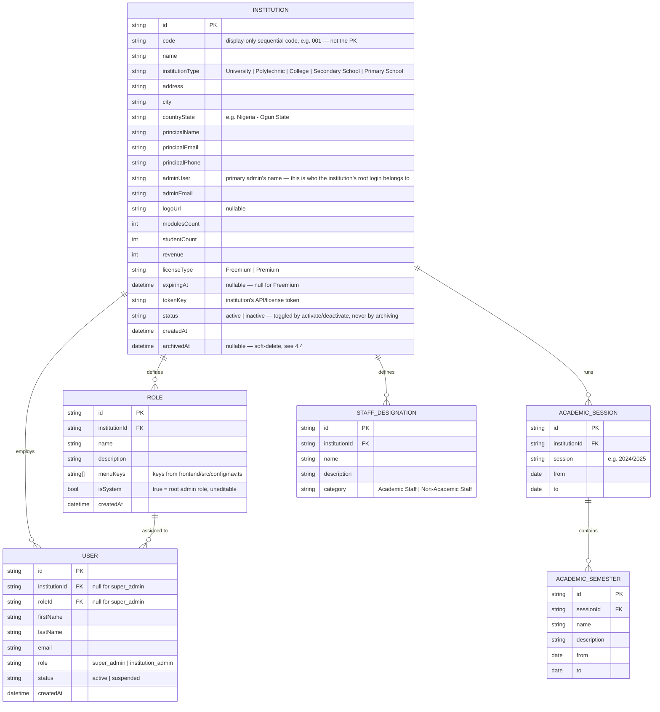
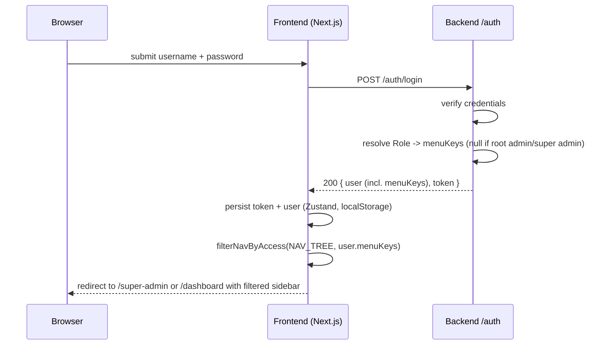
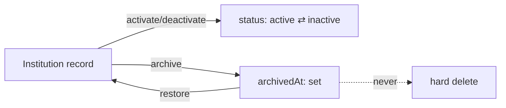
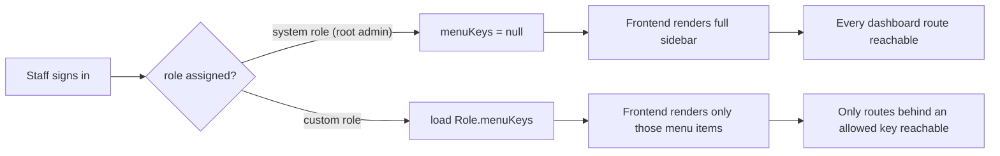
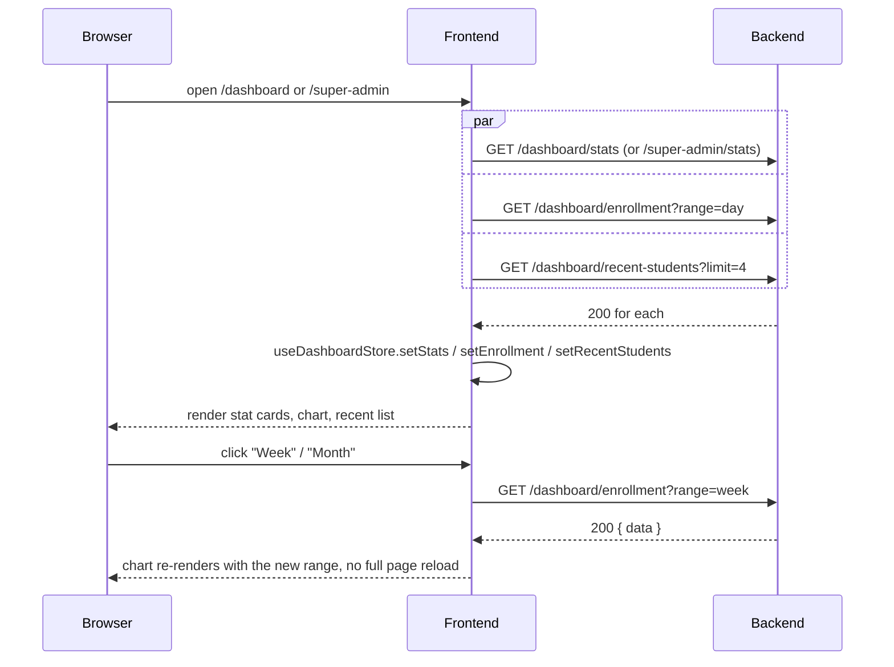

# T-Educare — API Contract

This is the spec the backend must implement so the existing frontend (already
built against a mocked version of this contract — see
[frontend/CLAUDE.md](../frontend/CLAUDE.md#no-backend-yet)) works unchanged
once wired to a real API. It supersedes the short version in
[README.md](./README.md).

Frontend reference points, if anything here is ambiguous:

- `frontend/src/services/auth.service.ts` — current mocked `authService`
- `frontend/src/store/rbac.store.ts` — Role/ManagedUser shape + seed data
- `frontend/src/store/institutions.store.ts` — Institution shape + seed data
- `frontend/src/store/academics.store.ts`, `src/store/staff.store.ts` — the
  two other mocked domains already wired to real pages
- `frontend/src/config/nav.ts` — the full, authoritative list of menu **keys**
  (`INSTITUTION_NAV`, `SUPER_ADMIN_NAV`) referenced by `Role.menuKeys` below

This document only covers what the frontend currently calls. More resources
(Registration, full Academics CRUD, Financials, Results, Hostel, Transport,
Announcements, Requests, Support, etc.) exist today only as nav entries
pointing at placeholder pages — their contracts will follow the same
conventions below and get added here as each one is built.

## Status

**Not implemented yet.** `backend/` has no code — see
[README.md](./README.md) for scaffolding steps. This file is what to build
*against*.

---

## 1. Conventions

- **Base URL**: `NEXT_PUBLIC_API_URL` (frontend `.env`), all paths below are
  relative to it.
- **Auth**: `Authorization: Bearer <token>` on every request except
  `POST /auth/login`. An invalid/expired token → `401`, which the frontend's
  axios interceptor treats as a forced logout.
- **Content type**: `application/json` both ways.
- **IDs**: opaque strings (UUID/cuid — anything stable and non-guessable).
- **Timestamps**: ISO 8601 UTC strings, e.g. `"2026-03-10T14:32:00.000Z"`.
- **Errors**: any non-2xx returns

  ```json
  { "error": "Human-readable message safe to show the user" }
  ```

  (`frontend/src/lib/axios.ts` reads `error.response.data.error` directly
  into the toast shown to the user — keep it short and non-technical.)
- **Lists**: paginated resources return

  ```json
  { "data": [ /* items */ ], "meta": { "page": 1, "perPage": 20, "total": 57 } }
  ```

  Query with `?page=1&perPage=20`. Small, bounded lists (roles, sessions,
  designations — anything an institution manages by hand, not "every
  student") may skip pagination and just return `{ "data": [...] }`.
- **Multi-tenancy is server-enforced, not client-supplied.** Every
  institution-scoped resource (roles, users, sessions, semesters,
  designations, and everything that follows) is implicitly filtered by the
  authenticated user's own institution — derived from their token server-side.
  Never accept a client-supplied `institutionId` on these routes; a request
  from institution A must be structurally incapable of reading or writing
  institution B's data, regardless of what a client sends.

---

## 2. Data model



---

## 3. Auth

### `POST /auth/login`

```json
// Request
{ "username": "Turon_Admin", "password": "Turon@2024" }
```

```json
// Response 200
{
  "user": {
    "id": "usr_123",
    "firstName": "Christian",
    "lastName": "Smart",
    "email": "christian.smart@turontech.com",
    "role": "institution_admin",
    "institutionId": "inst_xyz",
    "institutionName": "XYZ College of Technology",
    "menuKeys": null
  },
  "token": "opaque-bearer-token"
}
```

- `role` is `"super_admin"` or `"institution_admin"`.
- `menuKeys` is the **resolved** permission set for this login, so the
  frontend can render the sidebar without a second round trip:
  - `null` → unrestricted (root admin of the institution, or super admin).
  - `string[]` → exactly the keys from `frontend/src/config/nav.ts` this user
    may see, resolved server-side from their `Role.menuKeys` at login time.
- Wrong credentials → `401 { "error": "Invalid username or password." }`
  (exact copy the frontend already shows for its mocked version — keep it,
  or update `frontend/src/services/auth.service.ts` to match a new one).

### `GET /auth/me`

Returns the same `user` shape as login, for session restore. Requires a
valid bearer token.

### `POST /auth/logout`

Invalidates the token server-side if your auth scheme supports that (e.g.
a session/refresh-token store). `204` on success. The frontend already
clears its own local state regardless of this call's outcome.



---

## 4. Institutions — super admin only

All routes below require `role: "super_admin"` → otherwise `403`.

### 4.1 List / create / edit

| Method | Path                    | Body                                          | Notes |
|--------|-------------------------|------------------------------------------------|-------|
| GET    | `/institutions`         | —                                              | list, supports pagination + `?search=` (matches name or adminUser) + `?includeArchived=true` (default `false` — see 4.4) |
| POST   | `/institutions`         | see 4.2                                        | `modulesCount`/`studentCount`/`revenue` default `0`, `licenseType` defaults `"Freemium"`, `expiringAt` defaults `null`, `status` defaults `"active"` |
| PATCH  | `/institutions/:id`     | any subset of `Institution` fields             | for editing; also accepts `{ status }` alone but prefer 4.3 for that so the intent (and audit trail) is explicit |

`Institution` response shape — see the ER diagram above.

### 4.2 Creating an institution — form fields

The "Add New Institution" form collects everything **except** `modulesCount`
and `licenseType` — those are configured afterwards via the Modules and
License Manager screens (still placeholders on the frontend today), so a
freshly created institution always starts at `modulesCount: 0`,
`licenseType: "Freemium"`, `expiringAt: null`.

```json
// POST /institutions request body
{
  "name": "Covenant University",
  "institutionType": "University",
  "address": "KM 10 Idiroko Road",
  "city": "Ota",
  "countryState": "Nigeria - Ogun State",
  "principalName": "Prof. David Oyedepo",
  "principalEmail": "principal@covenantuniversity.edu.ng",
  "principalPhone": "08011112222",
  "adminUser": "Ngozi Eze",
  "adminEmail": "admin@covenantuniversity.edu.ng",
  "logoUrl": "https://cdn.example.com/logos/covenant.png"
}
```

`logoUrl` — the frontend currently only previews the picked file locally
(via `URL.createObjectURL`, never uploaded anywhere). A real backend should
expose a small upload endpoint (e.g. `POST /uploads/institution-logo`,
multipart, returning `{ "url": "..." }`) that the frontend calls first, then
sends the resulting `url` as `logoUrl` in this request.

`code` and `tokenKey` are server-generated — never accept them from the
client. `id` and `createdAt` are standard server-generated fields.

### 4.3 Activate / deactivate

```
PATCH /institutions/:id/status
{ "status": "active" }   // or "inactive"
```

The frontend always confirms this with the user first ("Are you sure you
want to activate/deactivate X?") before calling it — that's a client-side
UX guard, not something the backend needs to enforce, but do treat this as
a meaningful state transition worth its own audit log entry (an institution
losing access is a significant event for whoever their `adminUser` is).

### 4.4 Archive / restore — soft delete only

**There is no hard-delete endpoint for institutions.** The frontend's
"delete" action archives instead — it sets `archivedAt` and hides the record
from the default list view; nothing is ever destroyed.

```
POST /institutions/:id/archive   → 200, sets archivedAt = now
POST /institutions/:id/restore   → 200, sets archivedAt = null
```

`GET /institutions` excludes archived records unless `?includeArchived=true`
is passed (that's what the frontend's "View archived" toggle calls). An
archived institution keeps its `status` field as-is (archiving is
orthogonal to active/inactive) — restoring one doesn't change `status`
either, it comes back exactly as it was archived.



---

## 5. Roles — institution admin, scoped to their own institution

All routes require `role: "institution_admin"`; results are implicitly
scoped to the caller's `institutionId`.

| Method | Path          | Body                                                    | Notes |
|--------|---------------|----------------------------------------------------------|-------|
| GET    | `/roles`      | —                                                        | includes the seeded system role |
| POST   | `/roles`      | `{ name, description, menuKeys: string[] }`               | `isSystem` always `false` for created roles |
| PATCH  | `/roles/:id`  | `{ name?, description?, menuKeys? }`                       | `403` if the target role `isSystem: true` |
| DELETE | `/roles/:id`  | —                                                        | `403` if `isSystem: true`; `409` if any user is still assigned it |

`menuKeys` must be validated server-side against the known key set (mirror
`frontend/src/config/nav.ts`'s `INSTITUTION_NAV` keys) — reject unknown keys
rather than silently storing them.

## 6. Users (staff) — institution admin, scoped to their own institution

| Method | Path          | Body                                        | Notes |
|--------|---------------|-----------------------------------------------|-------|
| GET    | `/users`      | —                                            | staff within the caller's institution |
| POST   | `/users`      | `{ name, email, roleId }`                     | `status` defaults `"active"`; this is what provisions a real login for that staff member (send them a credential/invite — mechanism is up to the backend) |
| PATCH  | `/users/:id`  | `{ name?, email?, roleId?, status? }`          | |
| DELETE | `/users/:id`  | —                                            | |



---

## 7. Academic Sessions & Semesters — institution admin

| Method | Path                        | Body                                                        |
|--------|-----------------------------|---------------------------------------------------------------|
| GET    | `/academic-sessions`        | —                                                              |
| POST   | `/academic-sessions`        | `{ session, from, to }`                                        |
| DELETE | `/academic-sessions/:id`    | —                                                              |
| GET    | `/academic-semesters`       | —                                                              |
| POST   | `/academic-semesters`       | `{ sessionId, name, description, from, to }`                    |
| DELETE | `/academic-semesters/:id`   | —                                                              |

`from`/`to` are plain `dd-mm-yyyy` strings in the current frontend mock —
either keep that (simplest, matches existing UI verbatim) or switch to ISO
dates and update `frontend/src/store/academics.store.ts` + the two forms in
`frontend/src/app/dashboard/academics/sessions/page.tsx` together.

## 8. Staff Designations — institution admin

| Method | Path                        | Body                                             |
|--------|-----------------------------|-----------------------------------------------------|
| GET    | `/staff-designations`       | —                                                    |
| POST   | `/staff-designations`       | `{ name, description, category }`                     |
| PATCH  | `/staff-designations/:id`   | `{ name?, description?, category? }`                   |
| DELETE | `/staff-designations/:id`   | —                                                    |

`category` is `"Academic Staff" | "Non-Academic Staff"`.

---

## 9. Dashboards

Both dashboards (`frontend/src/app/dashboard/page.tsx` and
`frontend/src/app/super-admin/page.tsx`) read from
`frontend/src/store/dashboard.store.ts` and `institutions.store.ts` today —
these routes are what should replace those stores' seed data.

### 9.1 Institution admin — `GET /dashboard/stats`

Scoped to the caller's own institution.

```json
{
  "registeredStudents": 48043,
  "applicants": 158429,
  "lecturers": 10238,
  "accumulatedProfit": 1248043
}
```

### 9.2 Institution admin — `GET /dashboard/enrollment?range=day|week|month`

Powers the "Registered students per program" chart. `range` defaults to
`"day"`.

```json
{ "data": [ { "label": "6am", "value": 8 }, { "label": "9am", "value": 22 } ] }
```

`label` is whatever the frontend should print on the x-axis for that
`range` (hour-of-day for `day`, weekday for `week`, month for `month`) —
the backend owns the bucketing, the frontend just renders what it's given.

### 9.3 Institution admin — `GET /dashboard/recent-students?limit=4`

```json
{
  "data": [
    { "id": "std_1", "name": "Amaka Chukwu", "registeredAt": "2026-09-10T07:12:00.000Z" }
  ]
}
```

`registeredAt` is a real ISO timestamp — the frontend formats it as relative
time ("2 hours ago") itself, don't pre-format it server-side.

### 9.4 Super admin — `GET /super-admin/stats`

A precomputed summary so the client doesn't have to page through every
institution just to sum three numbers (it can still cross-check against
`GET /institutions` — see §4 — but shouldn't have to).

```json
{ "institutionsCount": 27, "totalStudents": 5622, "totalRevenue": 1528600 }
```

(The frontend's mock seed currently has 27 institutions, for a realistic
pagination/search demo — see `institutions.store.ts`. Numbers above match
that seed; a real backend obviously computes them from actual rows and
should exclude archived institutions from the count, same as §4.4.)

The "Recent Added Institutions" table on this same dashboard is just
`GET /institutions` (§4) sorted by `createdAt` desc, `limit=5` — no separate
endpoint needed.



---

## 10. What's mocked today, for reference

Until the above exists, the frontend fakes all of it client-side with three
hardcoded demo accounts (see `frontend/src/services/auth.service.ts`) and
Zustand stores seeded with fixture data (`persist`-backed for anything a user
edits — roles, users, institutions, sessions, designations; plain, unpersisted
for read-only dashboard data — see `dashboard.store.ts`) — swap each store's
actions for real calls to the routes above one domain at a time; nothing
else in the UI needs to change.
