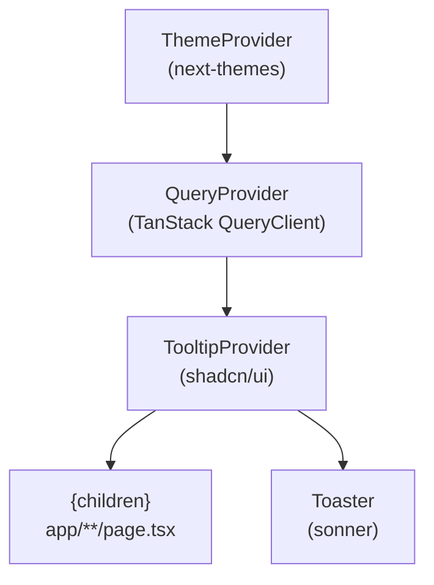
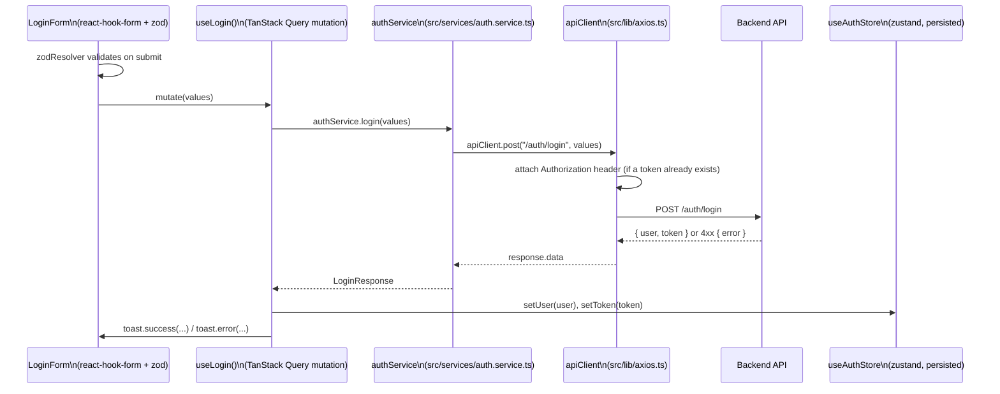

# T-Educare — Frontend

Next.js (App Router) web app for T-Educare. See the repo root
[README.md](../README.md) for the monorepo overview and
[CLAUDE.md](CLAUDE.md) for AI-agent conventions.

## Stack

- **Framework**: Next.js 16 (App Router, React 19)
- **Language**: TypeScript
- **Styling**: Tailwind CSS v4 + [shadcn/ui](https://ui.shadcn.com) (`base-nova` preset, built on `base-ui`)
- **Server state**: TanStack Query
- **Client state**: Zustand
- **Forms & validation**: React Hook Form + Zod
- **HTTP**: Axios
- **Misc**: `next-themes` (dark mode), `sonner` (toasts), `lucide-react` (icons)

## Provider tree

Mounted once in [`src/app/layout.tsx`](src/app/layout.tsx):



## Request lifecycle

How a typical mutation (login) flows through the layers — the same shape
applies to every feature added under `src/services/` + `src/hooks/`:



A 401 from any other endpoint is caught by the same `apiClient` response
interceptor, which clears `useAuthStore` and redirects to `/login`.

## Folder structure

```
src/
├─ app/                 # routes (App Router) — pages, layouts, metadata
├─ components/
│  ├─ ui/               # shadcn/ui primitives (generated — edit in place)
│  ├─ features/<name>/  # feature-specific components
│  ├─ layouts/          # headers, nav, sidebars, route shells
│  ├─ providers/        # QueryProvider, etc.
│  ├─ theme/            # ThemeProvider
│  └─ shared/           # cross-feature reusable UI
├─ hooks/                # TanStack Query hooks wrapping services (use-*.ts)
├─ services/             # one *.service.ts per API domain (axios calls)
├─ store/                # one *.store.ts per Zustand domain
├─ lib/
│  ├─ axios.ts           # configured apiClient + interceptors
│  ├─ utils.ts           # cn() re-export
│  └─ validations/       # one *.schema.ts per domain (zod)
├─ types/                # shared TypeScript types
└─ config/               # site.ts, nav config, etc.
```

## Commands

```bash
pnpm dev         # start dev server (http://localhost:3000)
pnpm build       # production build
pnpm start       # run the production build
pnpm lint        # eslint
pnpm typecheck   # tsc --noEmit
pnpm format      # prettier --write .
```

Add a shadcn/ui component:

```bash
pnpm dlx shadcn@latest add <component>
```

## Environment variables

Copy `.env.example` to `.env.local` and fill in:

| Variable               | Purpose                                                    |
| ---------------------- | ---------------------------------------------------------- |
| `NEXT_PUBLIC_API_URL`  | Base URL for the backend API, used by `src/lib/axios.ts`   |
| `NEXT_PUBLIC_SITE_URL` | Public site URL, used for metadata in `src/config/site.ts` |
